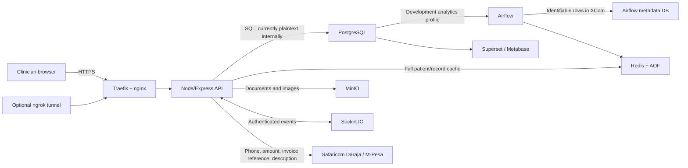

# MediMesh whole-project cybersecurity and Kenyan health-data review

**Review date:** 23 July 2026
**Reviewed branch/commit:** `revitalize-hospital-operations` / `fc0359464`
**Assessment type:** source-assisted architecture, application, infrastructure, data-governance, repository, and statutory control review
**Overall result:** **NO-GO for live patient data**

## 1. Executive conclusion

MediMesh must not process live patient data in its current state.

The release contains several good defensive controls—mandatory production MFA, strong password hashing, production configuration validation, public-edge HTTPS, safe error handling, private data-service ports, payment reconciliation, encrypted backups, and a useful regulatory release-gate document. Those controls are not enough to offset the following release blockers:

1. authenticated users receive hospital-wide access based primarily on broad roles, without patient assignment, care-team, department, clinic, encounter, facility, or purpose checks;
2. clinical and financial operations trust client-supplied clinician identities, patient/encounter relationships, and—in some paths—prices;
3. five non-placeholder secret files are tracked in Git, while additional predictable credentials are embedded in development, identity, analytics, and database configuration;
4. the production API connects as the PostgreSQL bootstrap superuser, MinIO uses its root credentials, database grants are excessive, and no database row-level security exists;
5. the persistent audit trail covers only a subset of patient/record JSON responses, is fail-open and mutable, and cannot meet the Kenyan requirement for secure, tamper-proof, comprehensive access logs retained for at least twenty years;
6. encryption at rest and on internal service links is documented as a host responsibility but is not enforced by the production package;
7. medical records can be overwritten or hard-deleted without a versioned amendment trail, legal hold, or a compliant archival workflow;
8. statutory and organizational evidence—ODPC registration, DPIA, Digital Health Agency certification, patient notices/rights workflows, processor agreements, and live incident procedures—is not present.

An attacker does not need to defeat MFA or exploit SQL injection to cause serious harm. A valid receptionist, nurse, doctor, diagnostic, billing, or other staff account can use ordinary API requests to reach data or workflow objects far outside the user’s demonstrated care responsibilities. A compromised privileged account or application container has almost unrestricted downstream access.

### Finding count

| Severity | Count | Meaning |
|---|---:|---|
| Critical | 5 | Broad health-data disclosure, clinical/financial integrity compromise, credential compromise, or statutory audit failure |
| High | 9 | Serious confidentiality, integrity, availability, deployment, or compliance weakness |
| Medium | 6 | Material defense-in-depth or operational weakness |
| Low | 2 | Reconnaissance, hygiene, or documentation risk |

This is a source/configuration review, not a legal opinion, certification, live-host configuration assessment, or penetration test. Findings described as statutory gaps mean that compliance is not demonstrated by the repository or that the implementation is inconsistent with a stated requirement. The deploying health facility and solution provider must obtain Kenyan legal and regulatory advice.

## 2. Scope and method

The review covered the complete project material relevant to the application and its release:

- React clinician web application;
- Node/Express patient API, route handlers, models, validation, WebSocket handling, authentication, audit, logging, storage, caching, and M-Pesa integration;
- PostgreSQL initialization and migrations, including ignored SQL files present in the working directory;
- Redis and MinIO data handling;
- development and production Compose definitions, Dockerfiles, nginx, backup/restore, release scripts, and secrets;
- Keycloak, Vault, Airflow, Metabase/Superset-related configuration, and ngrok;
- GitHub Actions security and release workflows;
- tests, lockfiles, documentation, Git tracking/history, archives, and packaged Word documents.

The working tree contained 297 relevant tracked project files plus eleven operational SQL files that are present but ignored by Git. The nested `MediMesh.git` data and installed `node_modules` trees were excluded from source-file counting, while lockfiles and the installed test tree were used for verification.

Methods included:

- manual trust-boundary and data-flow review;
- route-by-route authorization and object-relationship analysis;
- static searches for dynamic execution, unsafe HTML, secret markers, cryptography, plaintext links, raw SQL construction, and compliance features;
- Git tracking/history checks without printing secret values;
- syntax checking of all 63 backend JavaScript files;
- backend test execution and bounded frontend test execution;
- production Compose rendering;
- exact backend production dependency audit against the npm advisory service;
- primary-source review of current Kenyan statutes and regulations.

Not performed: live exploitation, dynamic browser/API penetration testing, container image scanning against a running registry, cloud/host inspection, database inspection with real data, mobile review, third-party contractual review, or organizational control testing.

## 3. Architecture and sensitive-data flows

Principal sensitive data includes names, dates of birth, national identifiers, phone/email/address, insurance and payment data, complaints, triage, diagnoses, notes, orders, results, prescriptions, DICOM/images, attachments, staff identity/licence information, authentication factors, M-Pesa transaction identifiers, IP addresses, and user-agent data.

PostgreSQL is the system of record. Full patient rows are copied into Redis for one hour and full medical records for thirty minutes (`Patient.js:81-100`, `MedicalRecord.js:54-85`); Redis append-only persistence creates another durable health-data copy. Files are copied to MinIO. The development analytics profile additionally puts identifiable patient rows into Airflow XCom and gives analytics tooling access to the clinical database.

## 4. Detailed technical findings

### C-01 — Broken object- and context-level authorization exposes hospital-wide data

**Severity:** Critical
**Classes:** OWASP API1 Broken Object Level Authorization; API5 Broken Function Level Authorization; CWE-639

Authorization checks mostly ask whether a user has any role in a route-level list. The persisted `department_id` is loaded into `req.user` but is not used to scope normal REST queries. There are no patient assignment, care-team, clinic, encounter, department, facility, or declared-purpose decisions, and no database row-level security.

Evidence:

- `services/patient-api/src/routes/patients.js:20-34` allows doctor, nurse, admin, and receptionist roles to list patients;
- `services/patient-api/src/models/Patient.js:31-56` uses `SELECT * FROM patients`, returning far more than a minimum staff directory;
- `patients.js:94-115` permits those roles to fetch any patient UUID;
- `patients.js:266-313` permits a receptionist to fetch the medical records of any selected patient;
- `records.js:22-58` and `records.js:124-145` expose global records to doctor, nurse, and admin roles;
- `queue.js:10-12` and `encounters.js:9-11` allow nearly every operational role to read or mutate global queues/encounters, which contain chief complaints and triage data;
- `staff.js:7-17` returns `s.*`, including staff contact and licensing fields, to broad directory roles;
- `files.js:281-328` allows any doctor, nurse, or admin to download any non-private file by UUID; files are non-private by default;
- WebSocket code does implement department/clinic checks, demonstrating that a scope attribute exists, but REST does not apply an equivalent policy.

Impact:

- mass disclosure of health, identity, contact, insurance, and financial data by an ordinary compromised staff account;
- unauthorized workflow changes, including queue movement across departments;
- absence of a defensible “minimum necessary” access model or evidence of who had a care-related reason to access a record.

Kenyan relevance:

- Data Protection Act sections 25 and 41 require minimization, privacy by default, and control of accessibility;
- section 46 restricts health-data processing to responsible providers or persons under professional secrecy;
- Health Act section 11 makes patient health/treatment/stay information confidential;
- 2025 Health Information Management Procedures Regulations, regulation 12, requires least privilege and access only to the minimum data needed for each role.

Required fix:

- define a server-side authorization matrix containing facility, department, clinic, care-team/assignment, patient, encounter, workflow state, action, and purpose;
- deny by default and enforce the same policy on lists, detail reads, search, files, exports, dashboards, WebSockets, and mutations;
- use database views or PostgreSQL row-level security as a second control, not as the only control;
- add a time-limited, reason-required “break glass” flow with immediate alerting and quarterly review;
- return purpose-specific projections instead of `SELECT *`;
- add negative cross-patient, cross-clinic, cross-department, and cross-role tests.

### C-02 — Clinical authorship, patient relationships, and prices can be forged

**Severity:** Critical
**Classes:** CWE-602; CWE-863; clinical safety and financial integrity

The API accepts identity and relationship fields from the browser instead of deriving them from the authenticated account and trusted records.

Evidence:

- `consultations.js:21-53` gives a client-supplied `doctorId` precedence over the authenticated account;
- the consultation route does not establish that the encounter belongs to the patient, that the clinician is assigned/licensed, or that the encounter is in an appropriate state;
- direct lab and radiology order routes accept `ordering_doctor_id`; the direct prescription route accepts `doctor_id`;
- `consultations.js:196-208`, `253-267`, and `310-331` use client-supplied test, study, or medication prices when present instead of always reading authoritative catalog prices;
- `pharmacy.js:301-331` accepts item `unit_price` directly;
- `consultations.js:153-169` creates `MedicalRecord` using the global pool instead of the active transaction client and treats failure as non-fatal, so a medical record can commit despite a later consultation rollback or a consultation can commit without its canonical record;
- `radiology.js:309-377` lets both radiographers and radiologists finalize/release reports and, when the authenticated application user is not a `staff` row, attributes the report to the ordering doctor;
- `lab.js:343`, `pharmacy.js:150`, and `billing.js:220` use `req.user.userId`, but authenticated users expose `req.user.id`; the actor field can therefore be null;
- lab result entry does not persist a result-entering user.

Impact:

- false clinical authorship and reports;
- orders or prescriptions attached to the wrong patient or encounter;
- inconsistent clinical records after partial commit;
- price suppression/inflation, incorrect billing, or stock/ledger attribution gaps;
- direct patient-safety risk and weak non-repudiation.

Required fix:

- derive clinician and actor identities exclusively from the authenticated account and a verified account-to-staff/provider mapping;
- verify professional identifier, licence/role, care assignment, patient/encounter/clinic relationship, and valid state transition;
- ignore client prices and calculate charges from versioned server-side catalogs;
- pass one transaction client through every clinical, queue, and billing write; fail and roll back the entire operation on any required write;
- separate acquisition/technical/reporting roles, require authorized report verification, and never substitute the ordering clinician;
- add append-only clinical signatures/version identifiers and tests for wrong-patient, wrong-provider, replay, and concurrent workflows.

### C-03 — Secrets are committed and predictable credentials are widespread

**Severity:** Critical
**Classes:** CWE-798; CWE-312

The following non-placeholder files are currently tracked by Git:

- `secrets/db_password.txt`
- `secrets/keycloak_db_password.txt`
- `secrets/keycloak_password.txt`
- `secrets/minio_password.txt`
- `secrets/minio_user.txt`

Their values were deliberately suppressed during this review. Adding `secrets/` to `.gitignore` does not untrack files already committed. Commit `49dd467979eb` contains them.

Additional predictable credentials/signing keys appear in `docker-compose.yml`, `init-scripts/01-create-databases.sql`, `keycloak-config/medimesh-realm.json`, `superset-config/superset_config.py`, and `archive/env.example`. The Keycloak realm seeds permanent weak user passwords. Airflow and Superset create weak administrative accounts. The development Vault uses a known root token.

Impact:

- anyone with repository access can impersonate services or users wherever these values were reused;
- deleting the files in a later commit does not remove them from Git history;
- a public or widely shared remote may already constitute a credential exposure incident.

Required fix:

1. treat every tracked or predictable credential as compromised;
2. immediately identify every environment in which it was used and rotate database, MinIO, Keycloak, Vault, Redis, JWT/MFA, Airflow, Superset, ngrok, and related credentials;
3. revoke sessions/tokens and review access logs before history rewriting;
4. remove files from the index and purge them from all Git refs, mirrors, forks, CI caches, and release artifacts using an approved history-rewrite process;
5. replace development values with generated one-time secrets and non-login fixtures;
6. add a pre-commit and CI scanner that rejects high-entropy and known-pattern secrets, not only provider-verified secrets.

If these credentials protected a deployed system, perform a documented incident assessment. Do not wait for proof of misuse before rotating them.

### C-04 — Production application and storage use root/superuser privileges

**Severity:** Critical
**Classes:** CWE-250; CWE-732

`deployment/compose.prod.yml:113-127` creates PostgreSQL with `POSTGRES_USER=medimesh`. The Docker PostgreSQL image makes that bootstrap user a superuser/database owner. `deployment/scripts/generate-secrets.sh:24-30` then builds the API `DATABASE_URL` with the same `medimesh` account. A compromised API process therefore has database-superuser authority.

`compose.prod.yml:146-156` supplies MinIO root credentials to MinIO, and the API receives the same user/password (`compose.prod.yml:66-68`). A compromised API can administer all buckets rather than use a bucket-scoped service account.

The local `init-scripts/01-create-databases.sql:8-122` creates several predictable service accounts, grants `CREATE` to `PUBLIC`, and grants all schema/table/sequence rights broadly. No RLS policy exists. The application role also receives `ALL` on all tables and sequences.

Impact:

- an API compromise becomes total database and object-storage compromise;
- audit rows, authentication records, clinical data, payments, and backups can be altered or destroyed;
- unrelated analytics/identity services have unnecessary schema capabilities.

Required fix:

- separate a non-login migration owner from a non-superuser runtime application role;
- grant only required `SELECT/INSERT/UPDATE` operations and tightly controlled procedures; deny normal deletion of protected records;
- revoke `CREATE` from `PUBLIC`, isolate service schemas/databases, remove cross-service grants, and set safe `search_path`;
- create a dedicated MinIO service user with actions restricted to the required buckets and object prefixes;
- use separate read-only analytics roles and views containing de-identified/minimum data;
- introduce immutable/separately owned audit storage and test all grants in CI.

### C-05 — Audit logging cannot establish compliant, tamper-proof access history

**Severity:** Critical
**Classes:** CWE-223; CWE-778

`middleware/audit.js` overrides only `res.json`; streamed file downloads do not enter this database path. `shouldLogToDatabase()` stores only URLs containing `/patients` or `/records` (`audit.js:73-76`). Consultations, orders, results, reports, prescriptions, files, queues, billing, payments, role changes, MFA changes, settings, and exports are generally stdout-only. Writes are asynchronous and not awaited by the response, and failure is swallowed (`audit.js:20-47`, `78-100`).

The database log stores the field names sent by a request but does not use captured old values (`audit.js:93-95`, `104-127`). The ordinary application database principal can mutate the supposedly immutable table. There is no hash chain, append-only role, WORM destination, signed export, retention enforcement, quarterly-review workflow, purpose, break-glass reason, or care relationship.

Production emits logs only to stdout unless the host supplies an external collector. The Compose release does not provide or integrate such a collector. The settings UI reads local log files that production does not create.

Kenyan relevance:

Regulation 12 of the 2025 Health Information Management Procedures Regulations requires all user actions and data access to be logged securely and tamper-proof with timestamps, user IDs, and actions; audit logs must be retained for at least twenty years, restricted, and reviewed quarterly.

Required fix:

- emit one structured audit event for every authentication event, read, search, list, stream, export, create, update, status transition, delete/archive, role/permission change, and privileged operation;
- record authenticated provider identifier, patient/resource, purpose/care relationship, request/correlation ID, result, source, before/after version IDs, and break-glass reason without duplicating unnecessary clinical payload;
- send events synchronously to a durable queue or append-only collector with back-pressure/alerting;
- use a write-only audit principal and independently administered immutable storage, retention lock, cryptographic integrity, monitored clock synchronization, and quarterly access-review reports;
- test that a successful sensitive operation cannot silently omit its audit event.

### H-01 — Encryption at rest and on internal links is not enforced

**Severity:** High

The public edge uses TLS, but production PostgreSQL, Redis, and MinIO connections use plaintext (`redis://`, `http://`, and no `DATABASE_SSL=true`). Health data is stored in normal Docker volumes. Database fields are plaintext. MinIO server-side encryption is optional in `storage.js:81-83,243-245` and is not set in the production Compose file. Full patient/record objects are persisted to Redis AOF.

The operations guide says to use encrypted host storage, but the package cannot verify or enforce that deployment fact. The 2025 regulations require strong encryption at rest and in transit, including backups.

Required fix:

- require and validate PostgreSQL TLS, Redis TLS, and MinIO HTTPS with trusted internal certificates;
- fail production startup when encryption settings are absent;
- enforce encrypted host volumes and KMS-managed MinIO/server-side encryption;
- tokenize or field-encrypt the highest-risk identifiers and credentials where justified by the DPIA;
- document key ownership, rotation, recovery, separation of duties, and cryptographic erasure.

### H-02 — Session and temporary-password controls leave reusable bearer tokens

**Severity:** High

Production tokens default to eight hours. The web application keeps them in `localStorage` (`AuthContext.js:23-25,64-74`; `services/api.js:12-17`), so any successful browser XSS or malicious same-origin script can steal a reusable bearer token.

`auth.js:223-225` reports logout success but does not increment `token_version` or otherwise revoke the token. `must_change_password` is loaded into the authenticated identity (`auth.js` and `middleware/auth.js:81-113`) but the middleware never blocks ordinary application routes. A user can continue using a temporary credential/session without changing it.

Positive context: JWT algorithm/issuer/audience and token-version checks are sound, MFA is required in production, password/MFA changes revoke earlier sessions, bcrypt cost is 12, and the password policy rejects bcrypt truncation.

Required fix:

- use short-lived access tokens in Secure, HttpOnly, SameSite cookies or a hardened backend-for-frontend session, with rotating refresh tokens and reuse detection;
- increment token version or revoke the session on logout;
- enforce `must_change_password` before every non-enrollment/non-logout route;
- reduce access-token lifetime and bind/revoke sessions per device;
- maintain CSP and add XSS-focused testing.

### H-03 — Clinical records are mutable/hard-deletable without archival governance

**Severity:** High

Doctors and admins can hard-delete medical records (`records.js:243-279`; `MedicalRecord.js:260`), and admins can hard-delete eligible patients (`patients.js:219-258`; `Patient.js:251-268`). Updates overwrite the current record without a versioned clinical amendment, reason, signer, or immutable history. The audit layer does not retain actual before/after versions.

The only repository retention value is a configurable seven-year setting (`SystemSettings.js:83-87`), and it does not drive an archival job. That value is not aligned with the 2025 regime’s twenty-year health-record archival model and twenty-year audit retention.

Required fix:

- replace normal hard delete with versioned amendment, correction, void, archive, and legal-hold workflows;
- prevent clinical-history erasure by ordinary application roles;
- preserve original author, amendment author, reason, timestamp, and previous version;
- implement the approved Kenyan retention/archival schedule, deceased-person rules, notification, de-identification, and County/National Health Data Bank workflow in consultation with DHA and counsel;
- distinguish statutory correction/erasure rights from unlawful destruction of clinical evidence.

### H-04 — File handling enables unauthorized distribution, malware storage, and memory exhaustion

**Severity:** High

Files are non-private by default (`files.js:46-53`). Any doctor, nurse, or admin can list broad file metadata; private metadata is not filtered (`files.js:345-400`). Non-private downloads require no patient/care-team relationship. Upload `patientId` and `recordId` relationships are not authorization-checked.

MIME validation trusts the multipart `Content-Type` supplied by the client (`files.js:27-41`). There is no magic-byte validation, antivirus scanning, content disarm/reconstruction, DICOM validation, macro handling, or quarantine. Allowed formats include Office documents, PDFs, images, DICOM, spreadsheets, CSV, and text.

Multer uses memory storage and permits ten files of 50 MB each (`files.js:20-26`; `storage.js:67`), allowing roughly 500 MB per request before processing and multiple concurrent requests.

Required fix:

- make clinical files private and patient-scoped by default;
- authorize upload/list/download/delete against the same care-context policy as the record;
- stream uploads to a quarantined bucket with strict request/concurrency quotas;
- verify signatures/magic bytes and scan content before promotion to an immutable clean bucket;
- disallow active content unless operationally required and reviewed;
- keep attachment downloads forced and `nosniff` (already implemented).

### H-05 — Analytics profile duplicates identifiable health data without minimization

**Severity:** High when enabled

`airflow/dags/medimesh_patient_etl.py:47-67` selects patient ID, name, DOB, gender, phone, and email and returns the full JSON through XCom. XCom normally persists in Airflow’s metadata database and is visible to Airflow administrators. The transformation only reformats identifiers; it does not de-identify them.

`superset_config.py` contains hard-coded database/signing/Redis credentials, enables SQL Lab against the clinical database, permits CTAS/CVAS, and defines no row-level filters (`ROW_LEVEL_SECURITY_FILTERS = {}`). Airflow/Superset create predictable admin users in `docker-compose.yml`.

These services are in the optional `analytics` development profile, not the production Compose package. The profile must nevertheless be treated as unsafe for real data.

Required fix:

- prohibit real patient data in the development analytics profile;
- use a separately governed, de-identified analytics pipeline with explicit purpose/lawful basis and DPIA;
- do not put identifiable rows in XCom or logs;
- use read-only views, minimum fields, aggregation thresholds, separate credentials, RLS, export restrictions, and retention;
- document whether any analytics/hosting recipient is outside Kenya and apply transfer safeguards.

### H-06 — Most clinical routes lack systematic input and state validation

**Severity:** High

Appointments, billing, consultations, encounters, lab, pharmacy, queue, radiology, schedules, staff, and wards have no Joi or shared validator usage despite exposing numerous handlers. Manual checks are incomplete. Examples include unbounded/invalid pagination, arbitrary status/next-queue transitions, clinically implausible values, unbounded notes/arrays within the global 1 MB JSON limit, and client-supplied identities/prices.

This creates denial-of-service, data-quality, patient-safety, and integrity risks even where SQL values are parameterized.

Required fix:

- define strict schemas for every path/query/body and reject unknown fields;
- cap pagination and array sizes;
- define numeric ranges, units, enums, field lengths, date relationships, and clinical state machines;
- validate patient/encounter/provider/catalog relationships under transaction locks;
- add property/fuzz tests and negative business-invariant tests.

### H-07 — The release is not reproducible from Git

**Severity:** High

The `.gitignore` rule `*.sql` ignores operational migrations. Only migrations 09, 10, and 11 are tracked; migrations 01-08 and 12-14 are present locally but untracked. Production mounts the whole `../init-scripts` directory into PostgreSQL (`compose.prod.yml:121-124`). A clean clone/release therefore cannot reliably create the reviewed schema and will not receive CI scanning for most SQL.

The installed backend dependency tree is also inconsistent with its lockfile: the storage test cannot load `@aws-sdk/client-s3`, despite the dependency appearing in `package.json`/`package-lock.json`.

Required fix:

- explicitly unignore and version every approved migration;
- introduce a migration tool with ordered, checksummed, forward/rollback-aware releases;
- test a clean-room database creation and upgrade in CI;
- use `npm ci` from a clean directory and fail release on lock/install drift;
- sign/attest the exact source, migration, SBOM, and image set as one release.

### H-08 — The default development stack is dangerous if started on a real network

**Severity:** High

The main Compose file defaults to development/demo auth and publishes the web application on all host interfaces. It also starts Vault in dev mode with a known root token. Optional profiles expose Keycloak over HTTP with seeded weak accounts, an unauthenticated Traefik dashboard, analytics tools with predictable admins, and an ngrok tunnel that permits HTTP and HTTPS. Several images use `latest`.

The README and production guide say the stack is for development/training and prohibit real patient data. That warning is important but does not technically stop accidental public/LAN exposure.

Required fix:

- bind development ports to `127.0.0.1`;
- put Vault and all demo services behind explicit profiles;
- prevent demo auth and ngrok from being enabled together;
- refuse startup when development credentials coexist with non-loopback/public exposure;
- generate ephemeral credentials, pin images, and provide synthetic data only.

### H-09 — MinIO policy and endpoint configuration are internally inconsistent

**Severity:** High for file availability

New buckets receive a policy denying `s3:*` when `aws:SecureTransport` is false (`storage.js:121-147`), while the production API connects to `http://minio:9000`. If MinIO enforces that condition, ordinary uploads/downloads will be denied. Bucket initialization failures are logged and swallowed (`storage.js:89-98`), so the API can become healthy without working storage. The health endpoint checks only PostgreSQL and Redis.

Required fix:

- use MinIO TLS and a certificate trusted by the API;
- make bucket/security initialization idempotent and fail readiness when it fails;
- add a least-privilege storage readiness check that performs a safe encrypted object round trip;
- test new installation, restore, certificate rotation, and unavailable-storage behavior.

### M-01 — M-Pesa secrets and transaction identifiers can leak through URLs/logs

**Severity:** Medium

The callback token is appended to the callback query string (`mpesa.js:317-322`). Although application access logs intentionally remove query strings, the token can still appear in provider, proxy, WAF, support, or upstream logs. The utility logs full checkout/receipt identifiers and upstream response bodies (`mpesa.js:133-159` and later query/callback paths). A client-supplied payment description is sent to Daraja (`payments.js:689-696`) and could contain health details.

Positive context: callback comparison is constant-time, production requires HTTPS and a callback token, and the reconciliation logic locks invoices, checks identities/amounts/phone/receipt uniqueness, and handles duplicate/late callbacks.

Required fix:

- use a high-entropy path segment or provider-supported signature/IP validation and rotate it; never retain callback tokens in logs;
- mask checkout, merchant, receipt, phone, and invoice references consistently;
- allow only a fixed non-clinical transaction description;
- document Safaricom as a recipient/processor as applicable, the purpose, fields, retention, contract, and cross-border position.

### M-02 — “DLP” and CSV export controls are ineffective

**Severity:** Medium

`dlpMiddleware` only reacts to `export=true` or an exact `Accept: text/csv` and simply caps a page to twenty records. It is not a data-loss-prevention system and can be bypassed by pagination or ordinary JSON list requests.

In `records.js`, `GET /:id` is registered before `GET /export`, so Express captures `/export` as an ID and the intended export route is unreachable. If reordered, record and log CSV construction does not neutralize spreadsheet formulas; log export also fails to escape quotes/newlines.

Required fix:

- rename this control to an export limit and implement real policy-based, purpose-approved exports;
- register static paths before parameter routes;
- require a separately authorized export job, reason, minimum fields, watermark, row/count limits, and durable audit;
- use a standards-compliant CSV library and prefix formula-leading cells.

### M-03 — Container/network segmentation and resource controls are incomplete

**Severity:** Medium

The web container joins both edge and backend networks; compromise of the web tier therefore provides direct network reachability to database, Redis, and MinIO. All backend services share one non-internal network. Traefik mounts the Docker socket read-only, which still exposes sensitive Docker API metadata/capability. No service has explicit CPU/memory/PID limits, and most do not drop Linux capabilities.

Required fix:

- split edge, application, database, cache, and storage networks; make data networks internal;
- do not connect nginx directly to data services;
- use a restricted Docker socket proxy or static routing configuration;
- add resource/PID limits, `cap_drop: [ALL]` where possible, explicit seccomp/AppArmor, read-only filesystems, and non-root runtime users for every image.

### M-04 — Authentication abuse detection is not durable or distributed

**Severity:** Medium

Login/MFA throttling is IP-based and process-local, with no account-based exponential backoff, distributed counter, suspicious-login alert, or lockout/unlock governance. Login/password-change events are sent to stdout rather than the durable audit system. TOTP verification has no replay prevention for an already-used time step.

Required fix:

- combine account, IP, device, and risk-based throttles in Redis;
- alert on password spraying, impossible patterns, MFA abuse, and privileged logins;
- persist login attempts and password changes in tamper-resistant audit storage;
- prevent TOTP step replay and provide secure recovery-code/help-desk procedures.

### M-05 — Supply-chain controls have gaps despite a strong CI foundation

**Severity:** Medium

Positive controls include SHA-pinned GitHub Actions, dependency audit jobs, CodeQL, Trivy gates, SBOM, and provenance. Gaps:

- TruffleHog uses `--only-verified` with `base: main`/`head: HEAD`, yet the five committed local secrets were not prevented;
- production images are tag-pinned but not digest-pinned;
- Dockerfile bases use mutable `node:22-alpine` and `nginx:alpine`;
- development images include `latest`;
- the frontend dependency advisory audit could not be completed in this environment, and its build/test toolchain is old (`react-scripts 5.0.1`).

The exact backend production graph returned **0 known npm advisories** on 23 July 2026. That is a point-in-time result, not proof that the code is safe.

Required fix:

- scan the entire repository and history for unverified/high-entropy secrets and add deterministic tests for prohibited paths;
- pin base and runtime images by digest and verify signatures/provenance;
- maintain an exception/SLA process for vulnerabilities;
- run clean frontend production and development audits in trusted CI and modernize the build toolchain.

### M-06 — Backup confidentiality is good, but authenticity/key separation can improve

**Severity:** Medium

Backups are encrypted with AES-256-CBC and PBKDF2 (600,000 iterations), and restore verifies a SHA-256 file. This protects confidentiality against casual loss and detects accidental corruption. CBC is not authenticated encryption, and the checksum is unkeyed; an attacker able to replace both archive and checksum can tamper with them. One passphrase encrypts every backup.

Required fix:

- use authenticated encryption such as AES-256-GCM or a mature envelope-encryption tool;
- sign manifests or store them in an independently protected system;
- introduce key versioning, rotation, separate backup-admin access, immutable/offline copies, and restore/audit evidence;
- ensure temporary plaintext backup work directories reside on encrypted storage.

### L-01 — Public health endpoint exposes operational details

**Severity:** Low

Unauthenticated `/health` reveals service identity/version, PostgreSQL and Redis availability, and process memory figures (`health.js:7-48`). Server error payload sanitization prevents raw 5xx messages from reaching clients, which is good.

Expose only a minimal liveness status publicly; put detailed readiness/metrics behind the private management network and authenticated monitoring.

### L-02 — Repository metadata and historical documentation create privacy/assurance risk

**Severity:** Low

Tracked DOCX files include creator metadata. Two tracked Office owner-lock files are not valid DOCX packages and can contain workstation/user metadata. Archived documents make obsolete “production-ready” and “HIPAA-compliant” claims that conflict with the current regulatory release-gate document.

No macros, embedded objects, or external relationship hosts were found in the three valid tracked DOCX packages.

Remove owner-lock files and unnecessary personal metadata, and clearly mark archived claims as superseded. Keep one authoritative security/compliance status document.

## 5. Kenyan legal and regulatory mapping

Primary sources reviewed:

- [Data Protection Act, 2019 (Cap. 411C)](https://new.kenyalaw.org/akn/ke/act/2019/24/eng%402022-12-31)
- [Data Protection (General) Regulations, 2021](https://new.kenyalaw.org/akn/ke/act/ln/2021/263/eng%402022-12-31)
- [Data Protection (Registration of Data Controllers and Data Processors) Regulations](https://new.kenyalaw.org/akn/ke/act/ln/2021/265/eng%402022-12-31)
- [Health Act, 2017](https://new.kenyalaw.org/akn/ke/act/2017/21/eng%402022-12-31)
- [Digital Health Act, 2023](https://new.kenyalaw.org/akn/ke/act/2023/15/eng%402023-11-24)
- [Digital Health (Health Information Management Procedures) Regulations, 2025](https://new.kenyalaw.org/akn/ke/act/ln/2025/76/eng%402025-04-11)
- [Digital Health (Data Exchange Component) Regulations, 2025](https://new.kenyalaw.org/akn/ke/act/ln/2025/77/eng%402025-04-11)
- [ODPC Guidance Note on Processing of Health Data](https://www.odpc.go.ke/wp-content/uploads/2024/02/ODPC-Guidance-Note-on-Processing-of-Health-Data.pdf)

| Requirement | Repository evidence | Assessment |
|---|---|---|
| Lawful, fair, transparent, specified and minimum processing — DPA s.25 | Broad `SELECT *`, hospital-wide roles, no purpose/care-context model | **Not met technically** |
| Data-subject notice and rights — DPA ss.26, 29, 38-40 | No patient privacy notice, objection/access/portability/correction workflow, or structured request ledger found | **Not demonstrated** |
| DPIA before high-risk processing — DPA s.31 and General Regulations | Health/sensitive/large-scale/linked data clearly triggers high-risk analysis; repository says DPIA is external | **Release blocker** |
| Privacy by design/default, pseudonymization/encryption/recovery — DPA s.41 | Some good controls, but access is overbroad and at-rest/internal-link encryption is not enforced | **Not met** |
| Controller-processor written contracts and guarantees — DPA s.42 | No executed agreements/subprocessor schedule evidence for hosting, support, Safaricom, etc. | **Not demonstrated** |
| Breach notification — DPA s.43 | No operational evidence for processor-to-controller 48-hour handling, controller-to-ODPC 72-hour handling, subject communication, or breach ledger | **Not demonstrated** |
| Health data under provider/professional secrecy — DPA s.46; Health Act s.11 | Named accounts/roles exist, but no verified provider identifier/care relationship and excessive receptionist/operational access | **High risk** |
| Cross-border safeguards and consent for sensitive data — DPA ss.48-49; General Regulations Part VII | No data-location/recipient/transfer register; image registries, ACME, Safaricom, support, backups, or analytics require classification | **Not demonstrated** |
| Mandatory ODPC registration for health administration/patient care | Repository correctly lists this as external; no certificate/evidence | **Release blocker** |
| Notify DHA within seven days after ODPC registration — 2025 Procedures reg.4 | No evidence | **Release blocker** |
| DHA breach notice within 48 hours and corrective/mitigation update within the following 72 hours — reg.11 | General incident guidance exists; no operational notification procedure/evidence | **Not demonstrated** |
| MFA, least privilege, unique provider-linked identities — reg.12 | MFA and named app accounts are good; least privilege and provider linkage fail | **Partially met / blocker** |
| Tamper-proof logs of all access, 20-year retention, quarterly review — reg.12 | Partial mutable database logs plus stdout | **Not met** |
| Strong encryption at rest/in transit and encrypted backups — reg.12 | Public TLS and encrypted backup exist; data volumes/internal links/SSE not enforced | **Partially met / blocker** |
| Health-data access only when authorized by client/controller — reg.13 | Broad roles, no object/care/purpose enforcement | **Not met** |
| Twenty-year health-data archival model and eight-year deceased archive timing — reg.15 | Seven-year setting, hard delete, no archive workflow | **Not met** |
| Correction within 72 hours — reg.20 | Staff can edit, but no authenticated data-subject request/SLA workflow | **Not demonstrated** |
| De-identification for secondary/statutory uses — reg.21 | Airflow processes directly identifiable data | **Not met for analytics profile** |
| DHA certification before a facility uses the solution — regs.36-40 | The repository correctly states that certification is not complete | **Absolute go-live blocker** |
| ODPC evidence, DPIA, policies, backup plan, and cybersecurity report in certification application — reg.38 | Some operational documents and this review exist; external evidence remains absent | **Incomplete** |
| Data-exchange onboarding/shared record and auditable access notifications — 2025 Data Exchange Regulations | Repository explicitly says national exchange integration is not implemented | **Release blocker where applicable** |

### Mandatory organizational evidence not established by source code

Before live use, the responsible organizations need documented evidence of:

- correct controller/processor/joint-controller roles and current ODPC registrations;
- notification to the Digital Health Agency after ODPC registration;
- an approved DPIA submitted in the legally required timeframe, including M-Pesa, files/images, Redis, backups, support, hosting, analytics, and cross-border transfers;
- a named and empowered Data Protection Officer where required;
- processing records, data inventory, data-flow and cross-border transfer registers;
- patient-facing privacy notices in clear language and a lawful-basis/consent matrix;
- access, portability, objection, correction, restriction, and erasure/archival request procedures with identity verification and statutory response times;
- processor/data-sharing agreements, subprocessor schedule, confidentiality duties, breach cooperation, return/deletion, audit rights, and location safeguards;
- a tested incident plan satisfying DHA 48-hour and ODPC 72-hour notification duties as applicable;
- a twenty-year tamper-proof audit-retention and quarterly-review program;
- clinical safety case, hazard log, provider/licence verification, change control, downtime records, and wrong-patient remediation;
- DHA certification, testing, certificate management/renewal, and required national exchange onboarding;
- independent penetration test, remediation, retest, secure-host verification, and restore/ransomware exercise.

## 6. Positive controls worth preserving

- Production rejects weak/missing JWT, MFA, database, Redis, MinIO, M-Pesa, or HTTPS configuration.
- Production MFA uses encrypted TOTP seeds with AES-256-GCM and requires a 32-byte key.
- Password hashing uses bcrypt cost 12; password policy requires length/complexity and rejects values bcrypt would truncate.
- JWT verification constrains HS256, issuer, audience, expiry, active account, and token version.
- Public ingress uses HTTPS, HSTS, CSP, anti-framing, MIME protection, strict referrer policy, CORS allowlisting, and no-store API headers.
- Server-side error sanitization prevents raw database/provider errors in 5xx JSON responses.
- API SQL values are generally parameterized; no `eval`, dynamic function, child-process, or dangerous React HTML sink was found in the static scan.
- M-Pesa reconciliation contains sound invoice locks, reservation expiry, amount/phone/request matching, receipt uniqueness, and duplicate/late callback handling.
- File names/object keys are constrained; downloads are streamed as attachments with `nosniff`.
- Production publishes only ports 80/443; PostgreSQL, Redis, and MinIO have no host-published ports.
- API and web production containers are read-only with `no-new-privileges`; API runs as a non-root user.
- Backup scripts encrypt, checksum, verify, and document restore testing.
- GitHub Actions are SHA-pinned and include dependency, CodeQL, container, SBOM, and provenance work.
- The current `REGULATORY-AND-RELEASE-GATES.md` correctly warns that the product is not certified, approved, independently penetration-tested, or authorized for live patient data.

## 7. Verification results

| Check | Result |
|---|---|
| Backend JS syntax | 63/63 files passed `node --check` |
| Backend tests | 15/16 suites passed; 66 tests passed |
| Backend test failure | Storage suite could not load missing installed `@aws-sdk/client-s3` |
| Frontend tests | Bounded 60-second run timed out without a result |
| Production Compose | `docker compose ... config -q` passed; Docker client emitted a local config-permission warning |
| Backend production dependency audit | 0 info/low/moderate/high/critical advisories on 23 July 2026 |
| Backend dev dependency audit | Not sent after external-disclosure approval was rejected; deprecated Supertest chain observed during lock import |
| Frontend dependency audit | Not completed; bounded lock import exceeded the run limit |
| Static dangerous-code search | No `eval`, `new Function`, child-process invocation, or `dangerouslySetInnerHTML` hit |
| Secret tracking | Five non-placeholder secret files confirmed tracked; values suppressed |
| SQL release tracking | 3 of 14 initialization/migration SQL files tracked |
| DOCX package inspection | No macros, embedded objects, or external hosts in the three valid DOCX packages; creator metadata present |

Test coverage is concentrated on authentication, MFA/runtime controls, M-Pesa, queues, files, storage utilities, error sanitization, password policy, and selected models. It does not establish cross-patient/department authorization, complete auditability, clinical state/identity integrity, retention, or statutory compliance.

## 8. Remediation plan

### Immediate: before any further deployment or demonstration with real data

1. Declare the current build non-production and block live patient data.
2. Disable public/LAN access to the development stack, demo identities, ngrok, and analytics.
3. Rotate every tracked/default credential and signing key; revoke sessions; assess exposure; preserve evidence; then purge Git history.
4. Confirm whether any real health data has entered PostgreSQL, Redis, MinIO, Airflow XCom, logs, backups, or analytics. If yes, initiate the controller/DPO incident and legal assessment.
5. Put release protection on the repository so no image/release can be issued from a failing, dirty, or incomplete migration state.

### Engineering release blockers

1. Implement context-aware authorization and database-level isolation.
2. Repair clinical identity, relationship, price, transaction, and actor attribution.
3. Replace superuser/root runtime access with least-privilege service accounts.
4. Build comprehensive tamper-resistant audit and twenty-year retention/review.
5. Enforce encryption at rest and in transit; repair MinIO TLS/readiness.
6. Introduce versioned clinical amendments, archive/legal hold, and approved retention.
7. Quarantine/scan/stream files and make them patient-scoped/private by default.
8. Add strict request schemas and state-machine validation everywhere.
9. Version every migration and prove clean install/upgrade/restore in CI.
10. Add security regression tests for every critical/high finding.

### Regulatory and operational gates

1. Complete controller/processor analysis and ODPC registration.
2. Complete and submit the DPIA in the required timeframe.
3. Implement notices, data-subject rights, processor agreements, transfer controls, and processor register.
4. Complete clinical safety, incident/breach, quarterly access review, training, and restore exercises.
5. Obtain DHA certification and applicable data-exchange onboarding.
6. Perform an independent penetration test after fixes, remediate, and obtain a clean retest.

### Suggested acceptance criteria

- no user can access a patient, encounter, order, record, file, invoice, queue, or dashboard outside a documented care/operational scope;
- every sensitive read/write/export produces a durable immutable audit event with the correct provider identity;
- application/analytics principals cannot alter audit history or administer PostgreSQL/MinIO;
- every clinical write is relationship-checked, catalog-priced, versioned, attributed, and atomic;
- storage encryption and internal TLS are automatically verified at startup/readiness;
- a clean clone creates the exact database, passes all tests/audits, and produces digest-pinned signed images;
- incident and restore exercises produce evidence that meets Kenyan notification, audit, retention, and recovery requirements;
- current ODPC/DHA/DPIA/contractual evidence is approved before any live patient is entered.

## 9. Final risk statement

MediMesh is a promising release candidate with several thoughtfully added security controls, but its core access-control, clinical-integrity, privilege, audit, encryption, retention, and release-reproducibility foundations are not yet suitable for Kenyan clinical production.

The most urgent lesson is that authentication and MFA do not establish lawful access. The system must be able to prove, for every patient-data action, **who** acted, **under which verified professional identity**, **for which patient and encounter**, **for what authorized purpose**, **within which facility/department/care relationship**, **what changed**, and **that the evidence cannot be altered**. The current implementation cannot do that.
