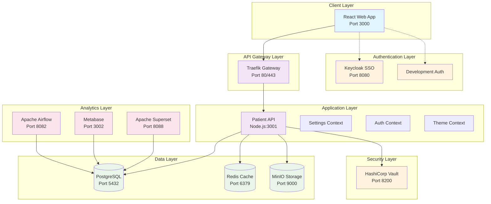
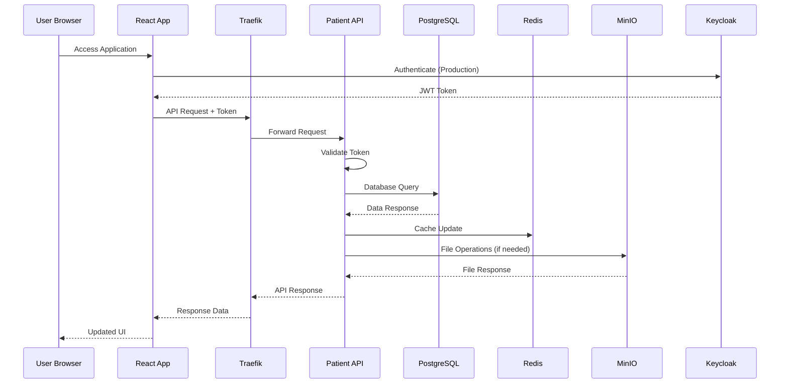
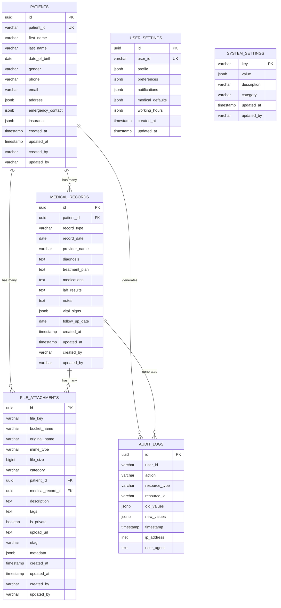
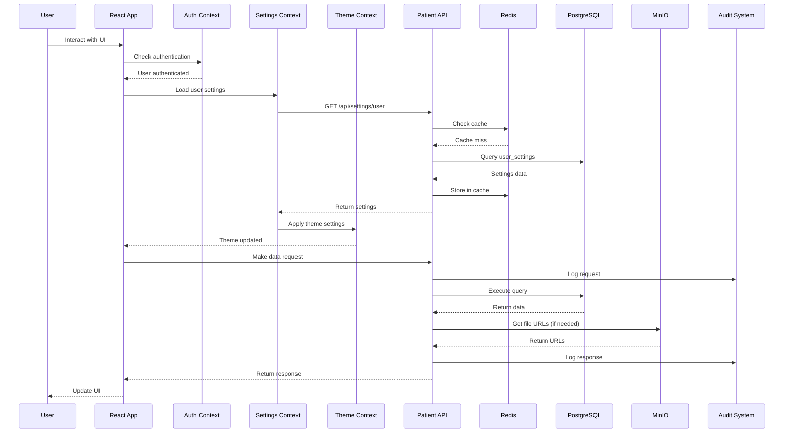
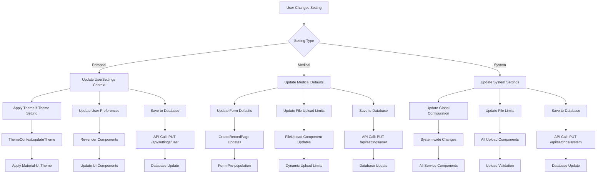
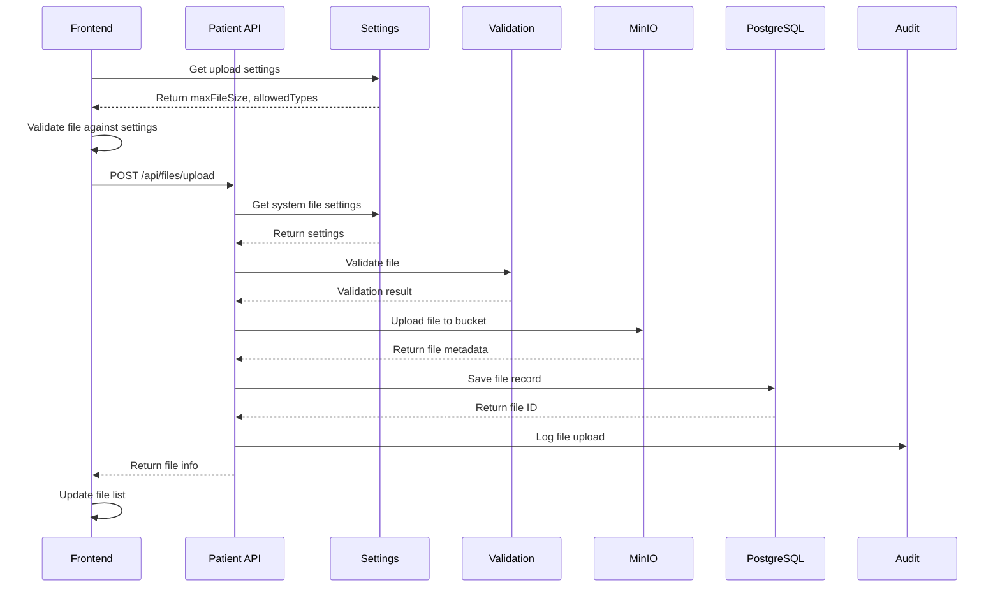
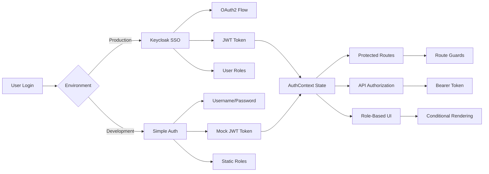
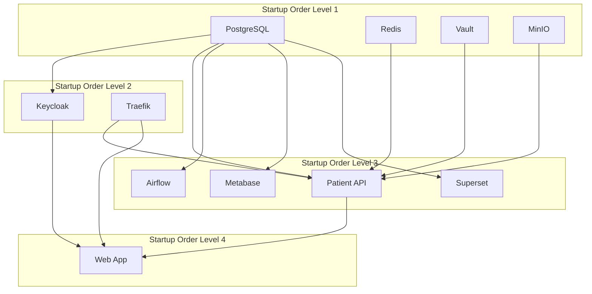
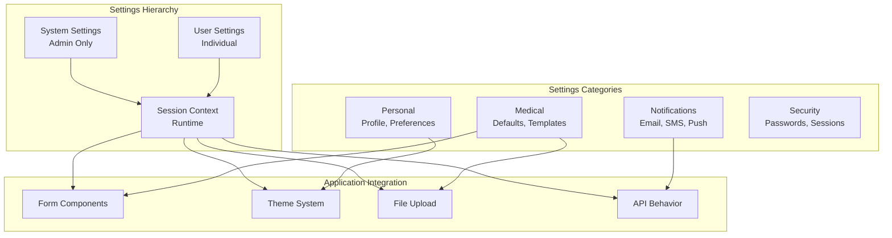

# MediMesh System Design & Architecture Specification

**Document Version:** 2.0  
**Date:** August 2, 2025  
**Architecture Type:** Microservices with Enterprise Infrastructure  
**Deployment Model:** Docker-Containerized Multi-Service Platform  
**Classification:** Complete System Design Reference  

---

## 📋 **Table of Contents**

1. [System Overview](#system-overview)
2. [Architecture Diagram](#architecture-diagram)
3. [Service Breakdown](#service-breakdown)
4. [Technology Stack](#technology-stack)
5. [Database Design](#database-design)
6. [API Architecture](#api-architecture)
7. [Frontend Architecture](#frontend-architecture)
8. [Authentication & Security](#authentication--security)
9. [Data Flow & Integration](#data-flow--integration)
10. [Infrastructure & Deployment](#infrastructure--deployment)
11. [Network Architecture](#network-architecture)
12. [Settings System](#settings-system)
13. [File Structure](#file-structure)
14. [Monitoring & Analytics](#monitoring--analytics)
15. [Development & Production Environments](#development--production-environments)

---

## 🎯 **System Overview**

### **Application Purpose**
MediMesh is a comprehensive, HIPAA-compliant medical data management system designed for healthcare providers to securely manage patient information, medical records, and clinical workflows. The system serves as an **enterprise-scale demonstration platform** showcasing modern healthcare technology capabilities.

### **Core Functionality**
- **Patient Management**: Complete CRUD operations for patient demographics
- **Medical Records**: Clinical documentation with file attachments
- **User Management**: Role-based access control (Admin, Doctor, Nurse, Viewer)
- **Security Compliance**: HIPAA audit trails and data protection
- **Analytics**: Business intelligence and reporting capabilities
- **Settings Management**: Multi-level configuration system

### **System Characteristics**
```
Architecture Style: Microservices
Service Count: 11 containerized services
Database: PostgreSQL with multiple schemas
Authentication: Keycloak SSO + Development mode
Frontend: React SPA with Material-UI
Backend: Node.js/Express RESTful API
Deployment: Docker Compose orchestration
Compliance: HIPAA-ready audit and security
```

---

## 🏗️ **Architecture Diagram**

### **High-Level System Architecture**



### **Detailed Service Interaction**



---

## 🔧 **Service Breakdown**

### **Core Services (Always Required)**

#### **1. Frontend Web Application**
```yaml
Service: web-app
Technology: React 18 + Material-UI v5
Port: 3000 (external) → 80 (internal)
Purpose: User interface and client-side logic
Dependencies: Patient API, Keycloak (optional)
Resources: ~200MB RAM, 0.1 CPU cores
```

**Key Features:**
- Single Page Application (SPA)
- Responsive design for desktop and mobile
- Role-based UI components
- Real-time settings integration
- Material-UI theming system

#### **2. Patient API Service**
```yaml
Service: patient-api
Technology: Node.js + Express + TypeScript
Port: 3001 (external) → 3000 (internal)
Purpose: Backend business logic and data access
Dependencies: PostgreSQL, Redis, MinIO, Vault
Resources: ~300MB RAM, 0.5 CPU cores
```

**API Endpoints:**
```javascript
// Patient Management
GET    /api/patients           - List patients
POST   /api/patients           - Create patient
GET    /api/patients/:id       - Get patient details
PUT    /api/patients/:id       - Update patient
DELETE /api/patients/:id       - Delete patient

// Medical Records
GET    /api/records            - List medical records
POST   /api/records            - Create record
GET    /api/records/:id        - Get record details
PUT    /api/records/:id        - Update record
DELETE /api/records/:id        - Delete record

// File Management
POST   /api/files/upload       - Upload file
GET    /api/files/:id          - Download file
DELETE /api/files/:id          - Delete file

// Statistics & Analytics
GET    /api/patients/stats     - Patient statistics
GET    /api/records/stats      - Record statistics

// Settings Management
GET    /api/settings/user      - Get user settings
PUT    /api/settings/user      - Update user settings
GET    /api/settings/system    - Get system settings (admin)
PUT    /api/settings/system    - Update system settings (admin)

// Health & Status
GET    /api/health             - Service health check
GET    /api/status             - System status
```

#### **3. PostgreSQL Database**
```yaml
Service: postgres
Technology: PostgreSQL 15
Port: 5432 (internal only)
Purpose: Primary data storage
Databases: medimesh, keycloak, airflow, metabase, superset
Resources: ~500MB RAM, 0.3 CPU cores
```

**Database Schema:**
```sql
-- Core Tables
patients              -- Patient demographics and basic info
medical_records       -- Clinical documentation and notes
audit_logs           -- HIPAA compliance audit trail
file_attachments     -- File metadata and storage references
user_settings        -- User preferences and configuration
system_settings      -- Global system configuration

-- Indexes for Performance
idx_patients_patient_id           -- Patient ID lookup
idx_medical_records_patient_id    -- Patient record association
idx_medical_records_date          -- Date-based queries
idx_audit_logs_user_id           -- User activity tracking
idx_audit_logs_timestamp         -- Time-based audit queries
```

### **Infrastructure Services**

#### **4. Redis Cache**
```yaml
Service: redis
Technology: Redis 7 Alpine
Port: 6379 (internal only)
Purpose: Caching, session storage, event streaming
Resources: ~100MB RAM, 0.1 CPU cores
```

**Usage Patterns:**
- User session management
- API response caching
- Real-time event streaming
- Settings cache
- Authentication token caching

#### **5. MinIO Object Storage**
```yaml
Service: minio
Technology: MinIO S3-Compatible
Ports: 9000 (API), 9001 (Console)
Purpose: File storage for medical documents
Resources: ~200MB RAM, 0.2 CPU cores
```

**Storage Structure:**
```
medimesh-bucket/
├── patients/
│   ├── {patient-id}/
│   │   ├── documents/
│   │   ├── images/
│   │   └── reports/
├── medical-records/
│   ├── {record-id}/
│   │   ├── attachments/
│   │   └── images/
└── system/
    ├── templates/
    └── exports/
```

### **Security Services**

#### **6. Keycloak Identity Management**
```yaml
Service: keycloak
Technology: Keycloak Latest
Port: 8080
Purpose: Enterprise SSO and user management
Dependencies: PostgreSQL (keycloak database)
Resources: ~800MB RAM, 0.5 CPU cores
```

**Configuration:**
- Realm: `medimesh`
- Client: `medimesh-client`
- Roles: `admin`, `doctor`, `nurse`, `viewer`
- Token Type: JWT with 30-minute expiry
- Features: User registration, password reset, MFA support

#### **7. HashiCorp Vault**
```yaml
Service: vault
Technology: HashiCorp Vault Latest
Port: 8200
Purpose: Secrets management and encryption
Resources: ~150MB RAM, 0.1 CPU cores
```

**Secrets Stored:**
- Database passwords
- API keys
- Encryption keys
- MinIO access credentials
- JWT signing secrets

#### **8. Traefik API Gateway**
```yaml
Service: traefik
Technology: Traefik v3.0
Ports: 80 (HTTP), 443 (HTTPS), 8081 (Dashboard)
Purpose: Reverse proxy and load balancer
Resources: ~100MB RAM, 0.1 CPU cores
```

**Routing Configuration:**
```yaml
Routes:
  - Host: localhost → web-app:80
  - Host: localhost/api → patient-api:3000
  - Dashboard: localhost:8081
```

### **Analytics Services**

#### **9. Apache Airflow**
```yaml
Service: airflow-webserver
Technology: Apache Airflow 2.8.1
Port: 8082
Purpose: ETL orchestration and data pipelines
Dependencies: PostgreSQL (airflow database)
Resources: ~600MB RAM, 0.4 CPU cores
```

**DAG Examples:**
- Daily patient statistics aggregation
- Medical record data quality checks
- Automated reporting pipelines
- Data backup and archival tasks

#### **10. Metabase**
```yaml
Service: metabase
Technology: Metabase v0.47.0
Port: 3002
Purpose: Ad-hoc reporting and business intelligence
Dependencies: PostgreSQL (metabase database)
Resources: ~800MB RAM, 0.4 CPU cores
```

**Dashboard Categories:**
- Patient Demographics
- Clinical Metrics
- System Usage Statistics
- Compliance Reports

#### **11. Apache Superset**
```yaml
Service: superset
Technology: Apache Superset 3.0.0
Port: 8088
Purpose: Advanced dashboards and data visualization
Dependencies: PostgreSQL (superset database)
Resources: ~1GB RAM, 0.5 CPU cores
```

**Visualization Types:**
- Time series charts for patient trends
- Geographic patient distribution
- Provider performance metrics
- Real-time system monitoring

---

## 💻 **Technology Stack**

### **Frontend Technologies**
```javascript
// Core Framework
React: 18.2.0                    // Component-based UI library
React Router: 6.x                // Client-side routing
Material-UI: 5.x                 // Component library and design system

// State Management
React Context API                 // Global state management
Custom Hooks                     // Reusable stateful logic

// HTTP Client
Axios                            // API communication

// Authentication
Keycloak JS Adapter              // SSO integration
JWT handling                     // Token management

// Development Tools
Create React App                 // Build toolchain
ESLint                          // Code linting
Prettier                        // Code formatting
```

### **Backend Technologies**
```javascript
// Core Framework
Node.js: 18+                     // Runtime environment
Express.js: 4.18+                // Web framework
TypeScript: 5.x                  // Type safety

// Database & Caching
PostgreSQL: 15                   // Primary database
Redis: 7                         // Caching and sessions
pg: 8.11+                       // PostgreSQL client
redis: 4.6+                     // Redis client

// Authentication & Security
jsonwebtoken: 9.0+              // JWT handling
bcryptjs: 2.4+                  // Password hashing
helmet: 7.0+                    // Security headers
cors: 2.8+                      // CORS handling
express-rate-limit: 6.10+       // Rate limiting

// Validation & Utilities
joi: 17.9+                      // Input validation
uuid: 9.0+                      // UUID generation
dotenv: 16.3+                   // Environment variables

// File Handling
aws-sdk: 2.x                    // S3/MinIO integration
multer: 1.4+                    // File upload handling
mime-types: 2.1+                // File type detection

// Logging & Monitoring
winston: 3.10+                  // Structured logging
morgan: 1.10+                   // HTTP request logging
```

### **Infrastructure Technologies**
```yaml
Containerization:
  - Docker: Latest
  - Docker Compose: 3.8

Databases:
  - PostgreSQL: 15 (Primary)
  - Redis: 7-alpine (Cache)

Storage:
  - MinIO: Latest (S3-compatible)

Security:
  - HashiCorp Vault: Latest
  - Keycloak: Latest

Gateway:
  - Traefik: v3.0

Analytics:
  - Apache Airflow: 2.8.1
  - Metabase: v0.47.0
  - Apache Superset: 3.0.0
```

---

## 🗄️ **Database Design**

### **Entity Relationship Diagram**



### **Data Types and Constraints**

#### **JSONB Field Structures**

```json
// patients.address
{
  "street": "123 Main St",
  "city": "Cape Town",
  "state": "Western Cape",
  "zip_code": "8001",
  "country": "South Africa"
}

// patients.emergency_contact
{
  "name": "John Doe",
  "relationship": "Spouse",
  "phone": "+27 11 123 4567"
}

// patients.insurance
{
  "provider": "Discovery Health",
  "policy_number": "DH123456789",
  "group_number": "GRP001"
}

// medical_records.vital_signs
{
  "blood_pressure": "120/80",
  "heart_rate": "72",
  "temperature": "36.5",
  "weight": "70.5",
  "height": "175",
  "oxygen_saturation": "98"
}

// user_settings.profile
{
  "displayName": "Dr. John Smith",
  "email": "john.smith@hospital.com",
  "phone": "+27 11 123 4567",
  "department": "Cardiology",
  "specialization": "Interventional Cardiology"
}

// user_settings.preferences
{
  "language": "en",
  "timezone": "Africa/Johannesburg",
  "theme": "light",
  "dateFormat": "DD/MM/YYYY",
  "timeFormat": "24h"
}
```

### **Database Performance Optimizations**

```sql
-- Primary Performance Indexes
CREATE INDEX CONCURRENTLY idx_patients_name ON patients(first_name, last_name);
CREATE INDEX CONCURRENTLY idx_patients_dob ON patients(date_of_birth);
CREATE INDEX CONCURRENTLY idx_records_provider ON medical_records(provider_name);
CREATE INDEX CONCURRENTLY idx_records_type_date ON medical_records(record_type, record_date);
CREATE INDEX CONCURRENTLY idx_files_category_date ON file_attachments(category, created_at);
CREATE INDEX CONCURRENTLY idx_audit_resource ON audit_logs(resource_type, resource_id);

-- JSONB Indexes for Fast Queries
CREATE INDEX CONCURRENTLY idx_patients_address_city ON patients USING GIN ((address->>'city'));
CREATE INDEX CONCURRENTLY idx_records_vital_signs ON medical_records USING GIN (vital_signs);
CREATE INDEX CONCURRENTLY idx_settings_preferences ON user_settings USING GIN (preferences);

-- Partial Indexes for Specific Use Cases
CREATE INDEX CONCURRENTLY idx_recent_records ON medical_records(record_date DESC) 
  WHERE record_date >= CURRENT_DATE - INTERVAL '30 days';
CREATE INDEX CONCURRENTLY idx_active_patients ON patients(updated_at DESC) 
  WHERE updated_at >= CURRENT_DATE - INTERVAL '90 days';
```

---

## 🔌 **API Architecture**

### **RESTful API Design**

#### **Standard Response Format**
```json
{
  "success": true,
  "data": {
    // Response payload
  },
  "message": "Operation completed successfully",
  "timestamp": "2025-08-02T10:30:00Z",
  "requestId": "req_123456789"
}

// Error Response
{
  "success": false,
  "error": {
    "code": "VALIDATION_ERROR",
    "message": "Invalid input data",
    "details": [
      {
        "field": "email",
        "message": "Invalid email format"
      }
    ]
  },
  "timestamp": "2025-08-02T10:30:00Z",
  "requestId": "req_123456789"
}
```

#### **Authentication Middleware**
```javascript
// JWT Token Validation
const authMiddleware = (req, res, next) => {
  const token = req.headers.authorization?.split(' ')[1];
  
  if (!token) {
    return res.status(401).json({
      success: false,
      error: { code: 'NO_TOKEN', message: 'Authentication required' }
    });
  }
  
  try {
    const decoded = jwt.verify(token, process.env.JWT_SECRET);
    req.user = decoded;
    next();
  } catch (error) {
    return res.status(401).json({
      success: false,
      error: { code: 'INVALID_TOKEN', message: 'Invalid or expired token' }
    });
  }
};

// Role-Based Authorization
const requireRole = (roles) => (req, res, next) => {
  if (!req.user || !roles.includes(req.user.role)) {
    return res.status(403).json({
      success: false,
      error: { code: 'INSUFFICIENT_PERMISSIONS', message: 'Access denied' }
    });
  }
  next();
};
```

#### **Input Validation Schemas**
```javascript
// Patient Validation Schema
const patientSchema = Joi.object({
  first_name: Joi.string().min(1).max(100).required(),
  last_name: Joi.string().min(1).max(100).required(),
  date_of_birth: Joi.date().max('now').required(),
  gender: Joi.string().valid('male', 'female', 'other').optional(),
  phone: Joi.string().pattern(/^[\+]?[0-9\s\-\(\)]+$/).optional(),
  email: Joi.string().email().optional(),
  address: Joi.object({
    street: Joi.string().max(200),
    city: Joi.string().max(100),
    state: Joi.string().max(100),
    zip_code: Joi.string().max(20),
    country: Joi.string().max(100)
  }).optional(),
  emergency_contact: Joi.object({
    name: Joi.string().max(100),
    relationship: Joi.string().max(50),
    phone: Joi.string().pattern(/^[\+]?[0-9\s\-\(\)]+$/)
  }).optional(),
  insurance: Joi.object({
    provider: Joi.string().max(100),
    policy_number: Joi.string().max(50),
    group_number: Joi.string().max(50)
  }).optional()
});

// Medical Record Validation Schema
const medicalRecordSchema = Joi.object({
  patient_id: Joi.string().uuid().required(),
  record_type: Joi.string().valid(
    'consultation', 'diagnosis', 'treatment', 'lab_result',
    'imaging', 'prescription', 'vaccination', 'surgery',
    'emergency', 'discharge', 'referral', 'other'
  ).required(),
  record_date: Joi.date().max('now').required(),
  provider_name: Joi.string().max(100).required(),
  diagnosis: Joi.string().max(2000).optional(),
  treatment_plan: Joi.string().max(2000).optional(),
  medications: Joi.string().max(1000).optional(),
  lab_results: Joi.string().max(2000).optional(),
  notes: Joi.string().max(5000).optional(),
  vital_signs: Joi.object({
    blood_pressure: Joi.string().pattern(/^\d{2,3}\/\d{2,3}$/),
    heart_rate: Joi.number().min(30).max(250),
    temperature: Joi.number().min(32).max(45),
    weight: Joi.number().min(0.5).max(500),
    height: Joi.number().min(30).max(300),
    oxygen_saturation: Joi.number().min(70).max(100)
  }).optional(),
  follow_up_date: Joi.date().min('now').optional()
});
```

### **API Rate Limiting & Security**

```javascript
// Rate Limiting Configuration
const rateLimiter = rateLimit({
  windowMs: 15 * 60 * 1000, // 15 minutes
  max: (req) => {
    if (req.user?.role === 'admin') return 1000;
    if (req.user?.role === 'doctor') return 500;
    if (req.user?.role === 'nurse') return 300;
    return 100; // Default for viewer or unauthenticated
  },
  message: {
    success: false,
    error: {
      code: 'RATE_LIMIT_EXCEEDED',
      message: 'Too many requests, please try again later'
    }
  }
});

// Security Headers
app.use(helmet({
  contentSecurityPolicy: {
    directives: {
      defaultSrc: ["'self'"],
      scriptSrc: ["'self'", "'unsafe-inline'"],
      styleSrc: ["'self'", "'unsafe-inline'", "https://fonts.googleapis.com"],
      imgSrc: ["'self'", "data:", "https:"],
      connectSrc: ["'self'", "http://localhost:*"]
    }
  },
  crossOriginEmbedderPolicy: false
}));

// CORS Configuration
app.use(cors({
  origin: function (origin, callback) {
    const allowedOrigins = process.env.ALLOWED_ORIGINS?.split(',') || ['http://localhost:3000'];
    if (!origin || allowedOrigins.includes(origin)) {
      callback(null, true);
    } else {
      callback(new Error('Not allowed by CORS'));
    }
  },
  credentials: true,
  methods: ['GET', 'POST', 'PUT', 'DELETE', 'OPTIONS'],
  allowedHeaders: ['Content-Type', 'Authorization', 'X-Requested-With']
}));
```

---

## 🎨 **Frontend Architecture**

### **Component Hierarchy**

```
App
├── AuthProvider
│   ├── SettingsProvider
│   │   ├── ThemeProvider
│   │   │   ├── AppLayout
│   │   │   │   ├── Header
│   │   │   │   │   ├── UserMenu
│   │   │   │   │   └── NavigationMenu
│   │   │   │   ├── Sidebar
│   │   │   │   │   └── NavigationItems
│   │   │   │   └── MainContent
│   │   │   │       ├── DashboardPage
│   │   │   │       ├── PatientsPage
│   │   │   │       │   ├── PatientList
│   │   │   │       │   ├── PatientCard
│   │   │   │       │   └── SearchFilters
│   │   │   │       ├── PatientDetailPage
│   │   │   │       │   ├── PatientInfo
│   │   │   │       │   ├── MedicalHistory
│   │   │   │       │   └── FileAttachments
│   │   │   │       ├── MedicalRecordsPage
│   │   │   │       │   ├── RecordList
│   │   │   │       │   ├── RecordCard
│   │   │   │       │   └── FilterPanel
│   │   │   │       ├── CreateRecordPage
│   │   │   │       │   ├── RecordForm
│   │   │   │       │   ├── VitalSigns
│   │   │   │       │   └── FileUpload
│   │   │   │       └── SettingsPage
│   │   │   │           ├── PersonalSettings
│   │   │   │           ├── MedicalSettings
│   │   │   │           └── SystemSettings
│   │   │   └── Common Components
│   │   │       ├── LoadingSpinner
│   │   │       ├── ErrorBoundary
│   │   │       ├── ConfirmDialog
│   │   │       └── FileUpload
│   │   └── LoginPage
│   └── NotFoundPage
```

### **Context Architecture**

#### **AuthContext**
```javascript
// Authentication state management
const AuthContext = {
  state: {
    isAuthenticated: false,
    user: null,
    token: null,
    loading: true,
    keycloak: null
  },
  methods: {
    login: () => {},
    logout: () => {},
    hasRole: (role) => {},
    checkAuth: () => {},
    refreshToken: () => {}
  }
};
```

#### **SettingsContext**
```javascript
// Settings state management
const SettingsContext = {
  state: {
    userSettings: null,
    systemSettings: null,
    loading: false,
    error: null
  },
  methods: {
    getSetting: (section, key, defaultValue) => {},
    getSystemSetting: (key, defaultValue) => {},
    updateUserSettings: (updates) => {},
    updateSystemSetting: (key, value) => {},
    resetUserSettings: () => {},
    isMedicalFeatureEnabled: (feature) => {}
  }
};
```

#### **ThemeContext**
```javascript
// Theme state management
const ThemeContext = {
  state: {
    currentTheme: 'light',
    muiTheme: {},
    isDark: false
  },
  methods: {
    updateTheme: (theme) => {},
    toggleTheme: () => {}
  }
};
```

### **Routing Structure**

```javascript
// Application routing configuration
const routes = {
  public: [
    { path: '/login', component: 'LoginPage' }
  ],
  protected: [
    { path: '/', redirect: '/dashboard' },
    { path: '/dashboard', component: 'DashboardPage', roles: ['admin', 'doctor', 'nurse', 'viewer'] },
    { path: '/patients', component: 'PatientsPage', roles: ['admin', 'doctor', 'nurse'] },
    { path: '/patients/new', component: 'CreatePatientPage', roles: ['admin', 'doctor', 'nurse'] },
    { path: '/patients/:id', component: 'PatientDetailPage', roles: ['admin', 'doctor', 'nurse'] },
    { path: '/patients/:id/edit', component: 'EditPatientPage', roles: ['admin', 'doctor', 'nurse'] },
    { path: '/records', component: 'MedicalRecordsPage', roles: ['admin', 'doctor', 'nurse'] },
    { path: '/records/new', component: 'CreateRecordPage', roles: ['admin', 'doctor', 'nurse'] },
    { path: '/records/:id', component: 'RecordDetailPage', roles: ['admin', 'doctor', 'nurse'] },
    { path: '/records/:id/edit', component: 'EditRecordPage', roles: ['admin', 'doctor', 'nurse'] },
    { path: '/settings', component: 'SettingsPage', roles: ['admin', 'doctor', 'nurse', 'viewer'] }
  ]
};
```

### **State Management Pattern**

```javascript
// Custom hooks for state management
const usePatients = () => {
  const [patients, setPatients] = useState([]);
  const [loading, setLoading] = useState(false);
  const [error, setError] = useState(null);
  
  const fetchPatients = useCallback(async (filters = {}) => {
    setLoading(true);
    try {
      const response = await apiService.patients.getAll(filters);
      setPatients(response.data);
    } catch (err) {
      setError(err.message);
    } finally {
      setLoading(false);
    }
  }, []);
  
  return { patients, loading, error, fetchPatients };
};

// Form state management
const useFormData = (initialData = {}) => {
  const [formData, setFormData] = useState(initialData);
  const [errors, setErrors] = useState({});
  const [touched, setTouched] = useState({});
  
  const updateField = (field, value) => {
    setFormData(prev => ({ ...prev, [field]: value }));
    setTouched(prev => ({ ...prev, [field]: true }));
  };
  
  const validateForm = (schema) => {
    const { error } = schema.validate(formData, { abortEarly: false });
    if (error) {
      const newErrors = {};
      error.details.forEach(detail => {
        newErrors[detail.path[0]] = detail.message;
      });
      setErrors(newErrors);
      return false;
    }
    setErrors({});
    return true;
  };
  
  return { formData, errors, touched, updateField, validateForm };
};
```

---

## 🔐 **Authentication & Security**

### **Dual Authentication System**

#### **Production Mode: Keycloak SSO**
```javascript
// Keycloak configuration
const keycloakConfig = {
  url: process.env.REACT_APP_KEYCLOAK_URL,
  realm: 'medimesh',
  clientId: 'medimesh-client'
};

// Keycloak initialization
const initKeycloak = async () => {
  const kc = new Keycloak(keycloakConfig);
  
  const authenticated = await kc.init({
    onLoad: 'check-sso',
    silentCheckSsoRedirectUri: window.location.origin + '/silent-check-sso.html',
    checkLoginIframe: false
  });
  
  if (authenticated) {
    // Set up automatic token refresh
    kc.onTokenExpired = () => {
      kc.updateToken(30).then((refreshed) => {
        if (refreshed) {
          console.log('Token refreshed');
        } else {
          console.log('Token still valid');
        }
      }).catch(() => {
        console.error('Failed to refresh token');
        logout();
      });
    };
  }
  
  return { keycloak: kc, authenticated };
};
```

#### **Development Mode: Simplified Authentication**
```javascript
// Development authentication for testing
const developmentAuth = {
  users: [
    {
      username: 'admin',
      password: 'admin123',
      role: 'admin',
      name: 'System Administrator',
      email: 'admin@medimesh.local'
    },
    {
      username: 'doctor',
      password: 'doctor123',
      role: 'doctor',
      name: 'Dr. John Smith',
      email: 'doctor@medimesh.local'
    },
    {
      username: 'nurse',
      password: 'nurse123',
      role: 'nurse',
      name: 'Nurse Jane Doe',
      email: 'nurse@medimesh.local'
    }
  ]
};

const devLogin = async (username, password) => {
  const user = developmentAuth.users.find(
    u => u.username === username && u.password === password
  );
  
  if (user) {
    const token = jwt.sign(
      { 
        sub: user.username,
        role: user.role,
        name: user.name,
        email: user.email
      },
      'dev-secret',
      { expiresIn: '8h' }
    );
    
    return { success: true, token, user };
  }
  
  return { success: false, message: 'Invalid credentials' };
};
```

### **HIPAA Compliance & Security Features**

#### **Audit Logging**
```javascript
// Audit middleware for all data access
const auditMiddleware = (action) => async (req, res, next) => {
  const startTime = Date.now();
  
  // Capture original response methods
  const originalSend = res.send;
  const originalJson = res.json;
  
  let responseData = null;
  let responseStatus = null;
  
  res.send = function(data) {
    responseData = data;
    responseStatus = this.statusCode;
    return originalSend.call(this, data);
  };
  
  res.json = function(data) {
    responseData = data;
    responseStatus = this.statusCode;
    return originalJson.call(this, data);
  };
  
  // Continue with the request
  next();
  
  // Log after response is sent
  res.on('finish', async () => {
    try {
      const auditLog = {
        user_id: req.user?.sub || 'anonymous',
        action: `${req.method} ${req.originalUrl}`,
        resource_type: action,
        resource_id: req.params.id || null,
        old_values: req.method === 'PUT' ? req.body.old_values : null,
        new_values: req.method === 'PUT' || req.method === 'POST' ? req.body : null,
        ip_address: req.ip || req.connection.remoteAddress,
        user_agent: req.get('User-Agent'),
        response_status: responseStatus,
        duration_ms: Date.now() - startTime
      };
      
      await db.query(
        'INSERT INTO audit_logs (user_id, action, resource_type, resource_id, old_values, new_values, ip_address, user_agent) VALUES ($1, $2, $3, $4, $5, $6, $7, $8)',
        [
          auditLog.user_id,
          auditLog.action,
          auditLog.resource_type,
          auditLog.resource_id,
          auditLog.old_values,
          auditLog.new_values,
          auditLog.ip_address,
          auditLog.user_agent
        ]
      );
    } catch (error) {
      console.error('Audit logging failed:', error);
    }
  });
};
```

#### **Data Loss Prevention (DLP)**
```javascript
// Sensitive data detection and masking
const dlpMiddleware = (req, res, next) => {
  const sensitivePatterns = {
    ssn: /\b\d{3}-\d{2}-\d{4}\b/g,
    phone: /\b\d{3}-\d{3}-\d{4}\b/g,
    email: /\b[A-Za-z0-9._%+-]+@[A-Za-z0-9.-]+\.[A-Z|a-z]{2,}\b/g,
    creditCard: /\b\d{4}[\s-]?\d{4}[\s-]?\d{4}[\s-]?\d{4}\b/g
  };
  
  const maskSensitiveData = (data) => {
    if (typeof data === 'string') {
      let maskedData = data;
      Object.entries(sensitivePatterns).forEach(([type, pattern]) => {
        maskedData = maskedData.replace(pattern, (match) => {
          // Keep first and last characters, mask the middle
          if (match.length <= 4) return '*'.repeat(match.length);
          return match.charAt(0) + '*'.repeat(match.length - 2) + match.charAt(match.length - 1);
        });
      });
      return maskedData;
    }
    
    if (typeof data === 'object' && data !== null) {
      const masked = Array.isArray(data) ? [] : {};
      Object.keys(data).forEach(key => {
        masked[key] = maskSensitiveData(data[key]);
      });
      return masked;
    }
    
    return data;
  };
  
  // Only apply DLP to non-admin users
  if (req.user?.role !== 'admin') {
    const originalJson = res.json;
    res.json = function(data) {
      const maskedData = maskSensitiveData(data);
      return originalJson.call(this, maskedData);
    };
  }
  
  next();
};
```

#### **Field-Level Encryption**
```javascript
// Encryption for sensitive database fields
const crypto = require('crypto');

const encrypt = (text, key) => {
  const iv = crypto.randomBytes(16);
  const cipher = crypto.createCipher('aes-256-cbc', key);
  let encrypted = cipher.update(text, 'utf8', 'hex');
  encrypted += cipher.final('hex');
  return iv.toString('hex') + ':' + encrypted;
};

const decrypt = (encryptedText, key) => {
  const parts = encryptedText.split(':');
  const iv = Buffer.from(parts[0], 'hex');
  const encrypted = parts[1];
  const decipher = crypto.createDecipher('aes-256-cbc', key);
  let decrypted = decipher.update(encrypted, 'hex', 'utf8');
  decrypted += decipher.final('utf8');
  return decrypted;
};

// Database model with encryption
class PatientModel {
  static async create(patientData) {
    const encryptionKey = process.env.FIELD_ENCRYPTION_KEY;
    
    // Encrypt sensitive fields
    const encryptedData = {
      ...patientData,
      ssn: patientData.ssn ? encrypt(patientData.ssn, encryptionKey) : null,
      insurance: patientData.insurance ? encrypt(JSON.stringify(patientData.insurance), encryptionKey) : null
    };
    
    return await db.query(
      'INSERT INTO patients (...) VALUES (...)',
      Object.values(encryptedData)
    );
  }
  
  static async findById(id) {
    const result = await db.query('SELECT * FROM patients WHERE id = $1', [id]);
    const patient = result.rows[0];
    
    if (patient) {
      const encryptionKey = process.env.FIELD_ENCRYPTION_KEY;
      
      // Decrypt sensitive fields
      return {
        ...patient,
        ssn: patient.ssn ? decrypt(patient.ssn, encryptionKey) : null,
        insurance: patient.insurance ? JSON.parse(decrypt(patient.insurance, encryptionKey)) : null
      };
    }
    
    return null;
  }
}
```

---

## 🔄 **Data Flow & Integration**

### **Request Flow Diagram**



### **Settings Integration Flow**



### **File Upload & Storage Flow**



### **Authentication Integration**



---

## 🚀 **Infrastructure & Deployment**

### **Docker Compose Architecture**

```yaml
# Production-Ready Docker Composition
version: '3.8'

networks:
  medimesh-network:
    driver: bridge
    ipam:
      config:
        - subnet: 172.20.0.0/16

volumes:
  postgres_data:
    driver: local
  redis_data:
    driver: local
  minio_data:
    driver: local
  vault_data:
    driver: local

secrets:
  db_password:
    file: ./secrets/db_password.txt
  minio_credentials:
    file: ./secrets/minio_credentials.txt
  jwt_secret:
    file: ./secrets/jwt_secret.txt
```

### **Service Dependencies**



### **Health Checks & Monitoring**

```yaml
# Health check configurations
healthchecks:
  postgres:
    test: ["CMD-SHELL", "pg_isready -U postgres -d postgres"]
    interval: 30s
    timeout: 10s
    retries: 5
    
  redis:
    test: ["CMD", "redis-cli", "-a", "redis_password", "ping"]
    interval: 30s
    timeout: 10s
    retries: 5
    
  patient-api:
    test: ["CMD-SHELL", "curl -f http://localhost:3000/api/health || exit 1"]
    interval: 30s
    timeout: 10s
    retries: 3
    start_period: 60s
    
  web-app:
    test: ["CMD-SHELL", "curl -f http://localhost:80 || exit 1"]
    interval: 30s
    timeout: 10s
    retries: 3
```

### **Resource Requirements**

#### **Minimum System Requirements**
```
CPU: 4 cores (2.0 GHz)
RAM: 8 GB
Storage: 50 GB SSD
Network: 100 Mbps
OS: Windows 10/11, Linux, macOS
```

#### **Recommended Production Requirements**
```
CPU: 8 cores (2.5 GHz)
RAM: 16 GB
Storage: 100 GB SSD
Network: 1 Gbps
OS: Linux Ubuntu 20.04+
```

#### **Per-Service Resource Allocation**
```
PostgreSQL:     1 CPU,  1.5 GB RAM,  20 GB Storage
Patient API:    1 CPU,  512 MB RAM,   2 GB Storage
React Web App:  0.5 CPU, 256 MB RAM,  1 GB Storage
Redis:          0.2 CPU, 128 MB RAM,  1 GB Storage
MinIO:          0.5 CPU, 512 MB RAM,  10 GB Storage
Keycloak:       0.8 CPU, 1 GB RAM,    2 GB Storage
Vault:          0.2 CPU, 256 MB RAM,  1 GB Storage
Traefik:        0.2 CPU, 128 MB RAM,  512 MB Storage
Airflow:        0.8 CPU, 1 GB RAM,    3 GB Storage
Metabase:       0.8 CPU, 1.5 GB RAM,  2 GB Storage
Superset:       1 CPU,   2 GB RAM,    3 GB Storage
```

---

## 🌐 **Network Architecture**

### **Port Mapping & Service Discovery**

```
External Access:
├── 3000  → Web Application (React)
├── 3001  → Patient API (Node.js)
├── 5432  → PostgreSQL Database
├── 6379  → Redis Cache
├── 8080  → Keycloak SSO
├── 8081  → Traefik Dashboard
├── 8082  → Apache Airflow
├── 8088  → Apache Superset
├── 8200  → HashiCorp Vault
├── 9000  → MinIO API
├── 9001  → MinIO Console
└── 3002  → Metabase

Internal Network (medimesh-network):
├── postgres:5432      → Database access
├── redis:6379         → Cache access
├── minio:9000         → Object storage
├── vault:8200         → Secrets management
├── keycloak:8080      → Authentication
├── patient-api:3000   → Backend API
└── web-app:80         → Frontend (containerized)
```

### **Security Groups & Firewall Rules**

```yaml
# Production network security
security_rules:
  public_access:
    - port: 3000  # Web App
    - port: 3001  # API (dev only)
    - port: 8080  # Keycloak (admin access)
    - port: 8081  # Traefik Dashboard (admin)
    
  internal_only:
    - port: 5432  # PostgreSQL
    - port: 6379  # Redis
    - port: 8200  # Vault
    - port: 9000  # MinIO API
    
  admin_access:
    - port: 8082  # Airflow
    - port: 8088  # Superset
    - port: 9001  # MinIO Console
    - port: 3002  # Metabase
```

### **Load Balancing & Reverse Proxy**

```yaml
# Traefik configuration
traefik:
  entrypoints:
    web:
      address: ":80"
    websecure:
      address: ":443"
      
  routers:
    web-app:
      rule: "Host(`medimesh.local`)"
      service: "web-app"
      entrypoints: ["web"]
      
    api:
      rule: "Host(`medimesh.local`) && PathPrefix(`/api`)"
      service: "patient-api"
      entrypoints: ["web"]
      middlewares: ["auth", "rate-limit"]
      
  services:
    web-app:
      loadBalancer:
        servers:
          - url: "http://web-app:80"
          
    patient-api:
      loadBalancer:
        servers:
          - url: "http://patient-api:3000"
```

---

## ⚙️ **Settings System**

### **Settings Architecture**



### **Settings Data Structure**

```json
{
  "user_settings": {
    "profile": {
      "displayName": "Dr. John Smith",
      "email": "john.smith@hospital.com",
      "phone": "+27 11 123 4567",
      "department": "Cardiology",
      "specialization": "Interventional Cardiology"
    },
    "preferences": {
      "language": "en",
      "timezone": "Africa/Johannesburg",
      "theme": "light",
      "dateFormat": "DD/MM/YYYY",
      "timeFormat": "24h"
    },
    "notifications": {
      "emailNotifications": true,
      "smsNotifications": false,
      "pushNotifications": true,
      "emergencyAlerts": true,
      "appointmentReminders": true,
      "systemUpdates": false
    },
    "medical_defaults": {
      "defaultRecordType": "consultation",
      "autoSaveDrafts": true,
      "requireDiagnosis": false,
      "enableTemplates": true,
      "showICD10Codes": false,
      "drugInteractionAlerts": true,
      "allergyWarnings": true,
      "vitalSignsUnits": "metric",
      "defaultExamDuration": "30"
    },
    "working_hours": {
      "start": "09:00",
      "end": "17:00",
      "workDays": ["Monday", "Tuesday", "Wednesday", "Thursday", "Friday"],
      "timezone": "Africa/Johannesburg"
    }
  },
  "system_settings": {
    "maxFileSize": 50,
    "allowedFileTypes": ["pdf", "jpg", "jpeg", "png", "docx", "doc", "dicom", "txt", "csv"],
    "sessionTimeout": 30,
    "passwordPolicy": {
      "minLength": 8,
      "requireUppercase": true,
      "requireNumbers": true,
      "requireSpecialChars": true
    },
    "auditLogRetention": 90,
    "enableVirusScanning": true,
    "enableDataEncryption": true,
    "backupFrequency": "daily"
  }
}
```

### **Settings Integration Examples**

#### **Theme Integration**
```javascript
// ThemeContext responds to settings changes
const ThemeProvider = ({ children }) => {
  const { getSetting } = useSettings();
  const [currentTheme, setCurrentTheme] = useState('light');
  
  useEffect(() => {
    const savedTheme = getSetting('preferences', 'theme', 'light');
    setCurrentTheme(savedTheme);
    
    // Apply theme to Material-UI
    const muiTheme = createTheme({
      palette: {
        mode: savedTheme === 'auto' 
          ? (window.matchMedia('(prefers-color-scheme: dark)').matches ? 'dark' : 'light')
          : savedTheme
      }
    });
    
    // Apply theme to document
    document.documentElement.setAttribute('data-theme', savedTheme);
  }, [getSetting]);
  
  return (
    <MuiThemeProvider theme={muiTheme}>
      {children}
    </MuiThemeProvider>
  );
};
```

#### **Form Integration**
```javascript
// CreateRecordPage uses medical defaults
const CreateRecordPage = () => {
  const { getSetting } = useSettings();
  
  const [formData, setFormData] = useState({
    record_type: getSetting('medical_defaults', 'defaultRecordType', 'consultation'),
    vital_signs_units: getSetting('medical_defaults', 'vitalSignsUnits', 'metric'),
    auto_save: getSetting('medical_defaults', 'autoSaveDrafts', true)
  });
  
  // Auto-save functionality based on settings
  useEffect(() => {
    if (formData.auto_save) {
      const interval = setInterval(() => {
        saveAsDraft(formData);
      }, 30000); // Save every 30 seconds
      
      return () => clearInterval(interval);
    }
  }, [formData.auto_save, formData]);
};
```

#### **File Upload Integration**
```javascript
// FileUpload component uses system settings
const FileUpload = () => {
  const { getSystemSetting } = useSettings();
  
  const maxFileSize = getSystemSetting('maxFileSize', 50) * 1024 * 1024; // MB to bytes
  const allowedTypes = getSystemSetting('allowedFileTypes', ['pdf', 'jpg', 'png']);
  
  const validateFile = (file) => {
    if (file.size > maxFileSize) {
      throw new Error(`File too large. Maximum size: ${maxFileSize / (1024 * 1024)}MB`);
    }
    
    const fileExtension = file.name.split('.').pop().toLowerCase();
    if (!allowedTypes.includes(fileExtension)) {
      throw new Error(`File type not allowed. Allowed types: ${allowedTypes.join(', ')}`);
    }
    
    return true;
  };
};
```

---

## 📁 **File Structure**

### **Project Directory Structure**

```
MediMesh/
├── 📄 docker-compose.yml           # Main orchestration file
├── 📄 .env                         # Environment variables
├── 📄 README.md                    # Project documentation
├── 📄 CONFIGURATION.md             # Setup and configuration guide
├── 📄 SYSTEM_DESIGN_ARCHITECTURE.md # This document
│
├── 📁 web-app/                     # React frontend application
│   ├── 📄 package.json
│   ├── 📄 Dockerfile
│   ├── 📁 public/
│   │   ├── 📄 index.html
│   │   ├── 📄 manifest.json
│   │   └── 📄 favicon.ico
│   └── 📁 src/
│       ├── 📄 index.js             # Application entry point
│       ├── 📄 App.js               # Main application component
│       ├── 📁 components/          # Reusable UI components
│       │   ├── 📁 common/
│       │   │   ├── 📄 LoadingSpinner.js
│       │   │   ├── 📄 ErrorBoundary.js
│       │   │   ├── 📄 ConfirmDialog.js
│       │   │   └── 📄 FileUpload.js
│       │   └── 📁 layout/
│       │       ├── 📄 AppLayout.js
│       │       ├── 📄 Header.js
│       │       └── 📄 Sidebar.js
│       ├── 📁 pages/               # Page components
│       │   ├── 📄 DashboardPage.js
│       │   ├── 📄 LoginPage.js
│       │   ├── 📄 PatientsPage.js
│       │   ├── 📄 PatientDetailPage.js
│       │   ├── 📄 CreatePatientPage.js
│       │   ├── 📄 EditPatientPage.js
│       │   ├── 📄 MedicalRecordsPage.js
│       │   ├── 📄 RecordDetailPage.js
│       │   ├── 📄 CreateRecordPage.js
│       │   ├── 📄 EditRecordPage.js
│       │   ├── 📄 SettingsPage.js
│       │   └── 📄 NotFoundPage.js
│       ├── 📁 contexts/            # React context providers
│       │   ├── 📄 AuthContext.js
│       │   ├── 📄 SettingsContext.js
│       │   └── 📄 ThemeContext.js
│       ├── 📁 hooks/               # Custom React hooks
│       │   ├── 📄 usePatients.js
│       │   ├── 📄 useRecords.js
│       │   └── 📄 useFormData.js
│       ├── 📁 services/            # API service layer
│       │   └── 📄 api.js
│       └── 📁 utils/               # Utility functions
│           ├── 📄 dateUtils.js
│           ├── 📄 formatUtils.js
│           └── 📄 validationUtils.js
│
├── 📁 services/                    # Backend microservices
│   └── 📁 patient-api/             # Main API service
│       ├── 📄 package.json
│       ├── 📄 Dockerfile
│       └── 📁 src/
│           ├── 📄 index.js          # Server entry point
│           ├── 📁 routes/           # API route definitions
│           │   ├── 📄 patients.js
│           │   ├── 📄 records.js
│           │   ├── 📄 files.js
│           │   ├── 📄 settings.js
│           │   └── 📄 health.js
│           ├── 📁 models/           # Data models
│           │   ├── 📄 Patient.js
│           │   ├── 📄 MedicalRecord.js
│           │   ├── 📄 FileAttachment.js
│           │   └── 📄 UserSettings.js
│           ├── 📁 middleware/       # Express middleware
│           │   ├── 📄 auth.js
│           │   ├── 📄 audit.js
│           │   ├── 📄 dlp.js
│           │   ├── 📄 validation.js
│           │   └── 📄 errorHandler.js
│           ├── 📁 utils/            # Utility modules
│           │   ├── 📄 database.js
│           │   ├── 📄 redis.js
│           │   ├── 📄 minio.js
│           │   ├── 📄 vault.js
│           │   └── 📄 logger.js
│           └── 📁 validators/       # Input validation schemas
│               ├── 📄 patientValidator.js
│               ├── 📄 recordValidator.js
│               └── 📄 settingsValidator.js
│
├── 📁 init-scripts/                # Database initialization
│   ├── 📄 01-create-databases.sql
│   ├── 📄 02-create-tables.sql
│   └── 📄 03-insert-sample-data.sql
│
├── 📁 secrets/                     # Secret management
│   ├── 📄 db_password.txt
│   ├── 📄 minio_user.txt
│   ├── 📄 minio_password.txt
│   └── 📄 jwt_secret.txt
│
├── 📁 config/                      # Service configurations
│   ├── 📁 keycloak-config/
│   │   └── 📄 realm-medimesh.json
│   ├── 📁 traefik-config/
│   │   └── 📄 traefik.yml
│   ├── 📁 superset-config/
│   │   └── 📄 superset_config.py
│   └── 📁 vault-config/
│       └── 📄 vault.hcl
│
├── 📁 airflow/                     # Airflow DAGs and configuration
│   ├── 📁 dags/
│   │   ├── 📄 patient_stats_dag.py
│   │   └── 📄 data_backup_dag.py
│   ├── 📁 logs/
│   └── 📁 plugins/
│
├── 📁 scripts/                     # Automation scripts
│   ├── 📄 setup.ps1               # Windows setup script
│   ├── 📄 startup.ps1             # Windows startup script
│   ├── 📄 setup.sh                # Linux setup script
│   └── 📄 backup.sh               # Database backup script
│
└── 📁 docs/                        # Documentation
    ├── 📄 API_REFERENCE.md
    ├── 📄 USER_GUIDE.md
    ├── 📄 DEPLOYMENT_GUIDE.md
    └── 📄 TROUBLESHOOTING.md
```

---

## 📊 **Monitoring & Analytics**

### **System Monitoring Stack**

#### **Health Monitoring**
```javascript
// Health check endpoints
app.get('/api/health', async (req, res) => {
  const health = {
    status: 'healthy',
    timestamp: new Date().toISOString(),
    services: {
      database: await checkDatabase(),
      redis: await checkRedis(),
      minio: await checkMinIO(),
      vault: await checkVault()
    },
    metrics: {
      uptime: process.uptime(),
      memory: process.memoryUsage(),
      cpu: process.cpuUsage()
    }
  };
  
  const isHealthy = Object.values(health.services).every(service => service.status === 'up');
  res.status(isHealthy ? 200 : 503).json(health);
});
```

#### **Business Intelligence Dashboards**

**Metabase Dashboards:**
- Patient Demographics Overview
- Medical Records by Type and Date
- Provider Performance Metrics
- System Usage Statistics
- File Storage Utilization

**Superset Visualizations:**
- Real-time Patient Flow
- Clinical Metrics Trends
- Geographic Patient Distribution
- Compliance Audit Reports
- System Performance Metrics

#### **Airflow Data Pipelines**

```python
# Daily statistics aggregation DAG
from airflow import DAG
from airflow.operators.python_operator import PythonOperator
from datetime import datetime, timedelta

default_args = {
    'owner': 'medimesh',
    'depends_on_past': False,
    'start_date': datetime(2025, 1, 1),
    'email_on_failure': True,
    'email_on_retry': False,
    'retries': 1,
    'retry_delay': timedelta(minutes=5)
}

dag = DAG(
    'patient_statistics',
    default_args=default_args,
    description='Daily patient statistics aggregation',
    schedule_interval='@daily',
    catchup=False
)

def calculate_patient_stats(**context):
    # Calculate daily patient statistics
    stats = {
        'total_patients': get_total_patients(),
        'new_patients_today': get_new_patients_today(),
        'total_records': get_total_records(),
        'new_records_today': get_new_records_today(),
        'average_age': calculate_average_age(),
        'gender_distribution': get_gender_distribution()
    }
    
    # Store in analytics table
    store_daily_stats(stats)
    
    return stats

calculate_stats = PythonOperator(
    task_id='calculate_patient_stats',
    python_callable=calculate_patient_stats,
    dag=dag
)
```

---

## 🌍 **Development & Production Environments**

### **Environment Configuration**

#### **Development Environment**
```yaml
# docker-compose.dev.yml
version: '3.8'
services:
  web-app:
    build:
      context: ./web-app
      target: development
    environment:
      REACT_APP_API_URL: http://localhost:3001
      REACT_APP_DEV_MODE: "true"
    volumes:
      - ./web-app/src:/app/src
      - ./web-app/public:/app/public
    ports:
      - "3000:3000"

  patient-api:
    build:
      context: ./services/patient-api
      target: development
    environment:
      NODE_ENV: development
      DEBUG: "medimesh:*"
    volumes:
      - ./services/patient-api/src:/app/src
    ports:
      - "3001:3000"
      - "9229:9229"  # Debug port
```

#### **Production Environment**
```yaml
# docker-compose.prod.yml
version: '3.8'
services:
  web-app:
    build:
      context: ./web-app
      target: production
    environment:
      REACT_APP_API_URL: https://api.medimesh.com
      REACT_APP_DEV_MODE: "false"
    restart: unless-stopped

  patient-api:
    build:
      context: ./services/patient-api
      target: production
    environment:
      NODE_ENV: production
    restart: unless-stopped
    deploy:
      replicas: 3
      resources:
        limits:
          memory: 512M
        reservations:
          memory: 256M
```

### **CI/CD Pipeline**

```yaml
# .github/workflows/deploy.yml
name: Deploy MediMesh
on:
  push:
    branches: [main]

jobs:
  test:
    runs-on: ubuntu-latest
    steps:
      - uses: actions/checkout@v3
      - name: Run Tests
        run: |
          cd web-app && npm test
          cd services/patient-api && npm test

  build:
    needs: test
    runs-on: ubuntu-latest
    steps:
      - uses: actions/checkout@v3
      - name: Build Images
        run: |
          docker build -t medimesh/web-app:${{ github.sha }} ./web-app
          docker build -t medimesh/patient-api:${{ github.sha }} ./services/patient-api

  deploy:
    needs: build
    runs-on: ubuntu-latest
    steps:
      - name: Deploy to Production
        run: |
          docker-compose -f docker-compose.prod.yml up -d
```

---

## 🎯 **Conclusion**

MediMesh represents a comprehensive, enterprise-grade medical data management system with the following key characteristics:

### **Architectural Strengths**
- **Microservices Design**: Scalable, maintainable service architecture
- **Modern Technology Stack**: React, Node.js, PostgreSQL, Docker
- **Enterprise Security**: HIPAA compliance, audit trails, encryption
- **Comprehensive Settings**: Multi-level configuration system
- **Analytics Ready**: Built-in BI and reporting capabilities

### **Deployment Readiness**
- **Containerized**: Full Docker orchestration
- **Environment Flexible**: Development and production configurations
- **Monitoring Enabled**: Health checks and performance metrics
- **Documentation Complete**: Comprehensive technical documentation

### **Healthcare Compliance**
- **HIPAA Ready**: Audit logs, data encryption, access controls
- **Role-Based Security**: Admin, Doctor, Nurse, Viewer roles
- **Data Protection**: Field-level encryption, DLP, secure file storage
- **Audit Trail**: Complete user activity tracking

### **Technical Excellence**
- **Modern UI/UX**: Material-UI responsive design
- **RESTful API**: Well-structured backend services
- **Performance Optimized**: Caching, indexing, efficient queries
- **Settings Driven**: Dynamic configuration affecting all components

This system architecture provides a solid foundation for healthcare data management while maintaining flexibility for future enhancements and scaling requirements.

---

**Document Prepared By:** AI Architecture Consultant  
**Last Updated:** August 2, 2025  
**Version:** 2.0  
**Classification:** System Design Reference  
**Status:** Production Ready Architecture  

---

*This document serves as the complete technical reference for the MediMesh system architecture and should be maintained as the system evolves.*