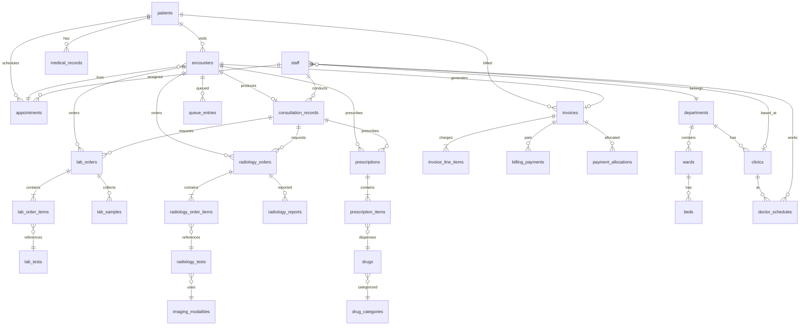

# MediMesh Database Schema Analysis

**Generated:** February 15, 2026  
**Database:** PostgreSQL 16 | Schema: `public`  
**Total Tables:** 51 | **Foreign Keys:** 123 | **Triggers:** 52

---

## Table of Contents

1. [Schema Overview](#schema-overview)
2. [Domain Model Diagram](#domain-model-diagram)
3. [Table Groups by Domain](#table-groups-by-domain)
4. [Core Entity Relationships](#core-entity-relationships)
5. [Staff & Role Model](#staff--role-model)
6. [Patient Lifecycle Flow](#patient-lifecycle-flow)
7. [Trigger & Automation Map](#trigger--automation-map)
8. [Table Details](#table-details)
9. [Data Volume Summary](#data-volume-summary)

---

## 1. Schema Overview

MediMesh uses a comprehensive hospital management schema organized into **8 functional domains**:

| Domain | Tables | Description |
|--------|--------|-------------|
| **Patient Management** | 3 | Patient records, medical records, file attachments |
| **Appointment & Scheduling** | 3 | Appointments, doctor schedules, reminders |
| **Encounter & Queue** | 2 | Patient encounters, queue management |
| **Clinical (Consultation)** | 1 | Consultation records with orders |
| **Laboratory** | 7 | Lab orders, items, tests, samples, equipment, queue, catalog |
| **Radiology** | 8 | Radiology orders, items, tests, images, reports, queue, modalities, catalog |
| **Pharmacy** | 5 | Prescriptions, items, drugs, categories, stock, transactions |
| **Billing & Finance** | 8 | Invoices, line items, payments, accounts, insurance, price lists |
| **Hospital Infrastructure** | 5 | Departments, clinics, locations, wards, beds |
| **Staff & Administration** | 5 | Staff, system settings, user settings, audit logs, setting changes |

---

## 2. Domain Model Diagram



---

## 3. Table Groups by Domain

### 3.1 Patient Management

| Table | PK Type | Rows | Key Columns | Purpose |
|-------|---------|------|-------------|---------|
| `patients` | UUID | 19 | uhid, first_name, last_name, date_of_birth, gender, phone, blood_group | Master patient index |
| `medical_records` | UUID | 1 | patient_id, record_date, record_type | Historical medical records |
| `file_attachments` | UUID | 0 | patient_id, medical_record_id, file_path | Document/image storage |

### 3.2 Appointment & Scheduling

| Table | PK Type | Rows | Key Columns | Purpose |
|-------|---------|------|-------------|---------|
| `appointments` | UUID | 12 | appointment_number, patient_id, doctor_id, clinic_id, scheduled_date/time, status | Appointment booking & tracking |
| `doctor_schedules` | UUID | 3 | doctor_id, clinic_id, day_of_week, start_time, end_time | Doctor availability windows |
| `appointment_reminders` | UUID | 0 | appointment_id, reminder_type, scheduled_at | SMS/email reminders |

**Appointment statuses:** `scheduled` -> `confirmed` -> `checked-in` -> `completed` / `cancelled` / `no-show`

### 3.3 Encounter & Queue Management

| Table | PK Type | Rows | Key Columns | Purpose |
|-------|---------|------|-------------|---------|
| `encounters` | UUID | 25 | encounter_number, patient_id, encounter_type, status, triage_level | Central visit tracking hub |
| `queue_entries` | UUID | 61 | encounter_id, patient_id, queue_type, service_type, priority_level, status | Real-time queue position tracking |

**Encounter statuses:** `registered` -> `waiting` -> `triage` -> `in-consultation` -> `pending-lab`/`pending-radiology`/`pending-pharmacy` -> `completed` / `cancelled`

**Queue types:** `consultation`, `lab`, `radiology`, `pharmacy`, `billing`

### 3.4 Clinical - Consultation Records

| Table | PK Type | Rows | Key Columns | Purpose |
|-------|---------|------|-------------|---------|
| `consultation_records` | UUID | 11 | encounter_id, patient_id, doctor_id, vitals, diagnosis, treatment_plan | Full consultation documentation |

Stores: vitals (BP, temp, pulse, SpO2, weight, height, BMI), clinical history, examination findings, provisional/differential/final diagnosis, treatment plan, and follow-up instructions.

### 3.5 Laboratory

| Table | PK Type | Rows | Key Columns | Purpose |
|-------|---------|------|-------------|---------|
| `lab_orders` | UUID | 7 | order_number, patient_id, encounter_id, ordering_doctor_id, status | Order header |
| `lab_order_items` | UUID | 14 | lab_order_id, test_id, status, result_value, abnormal_flag | Individual test results |
| `lab_tests` | SERIAL | 8 | test_code, test_name, test_category, normal_range_min/max | Test definitions |
| `lab_test_catalog` | SERIAL | 15 | test_code, test_name, department, turnaround_hours | Extended test catalog |
| `lab_samples` | UUID | 0 | lab_order_id, sample_type, barcode, collected_by | Sample tracking |
| `lab_queue` | UUID | 0 | lab_order_id, patient_id, priority | Lab-specific queue |
| `lab_equipment` | UUID | 0 | equipment_name, equipment_type, serial_number | Equipment inventory |

**Lab order statuses:** `pending` -> `sample-collected` -> `in-progress` -> `completed` / `cancelled`

### 3.6 Radiology

| Table | PK Type | Rows | Key Columns | Purpose |
|-------|---------|------|-------------|---------|
| `radiology_orders` | UUID | 6 | order_number, patient_id, encounter_id, ordering_doctor_id, status | Order header |
| `radiology_order_items` | UUID | 6 | radiology_order_id, test_id, body_part, status | Individual study items |
| `radiology_tests` | SERIAL | 7 | test_code, test_name, modality_id, preparation_required | Study definitions |
| `radiology_study_catalog` | SERIAL | 15 | study_code, study_name, modality, body_region | Extended study catalog |
| `radiology_reports` | UUID | 0 | radiology_order_id, radiologist_id, findings, impression | Reporting |
| `radiology_images` | UUID | 0 | radiology_order_item_id, file_path, image_type | DICOM/image storage |
| `radiology_queue` | UUID | 0 | radiology_order_id, patient_id, modality_id | Radiology-specific queue |
| `imaging_modalities` | SERIAL | 7 | modality_code, modality_name (X-Ray, CT, MRI, US, etc.) | Equipment types |

**Radiology order statuses:** `pending` -> `scheduled` -> `in-progress` -> `completed` -> `reported` / `cancelled`

### 3.7 Pharmacy

| Table | PK Type | Rows | Key Columns | Purpose |
|-------|---------|------|-------------|---------|
| `prescriptions` | UUID | 11 | prescription_number, patient_id, encounter_id, doctor_id, status | Prescription header |
| `prescription_items` | UUID | 16 | prescription_id, drug_id, dosage, frequency, quantity, dispensed_quantity | Line items with dispensing |
| `drugs` | SERIAL | 8 | drug_code, generic_name, brand_name, category_id, stock_quantity | Drug inventory |
| `drug_categories` | SERIAL | 10 | category_name, description | Drug classification |
| `drug_stock_movements` | UUID | 0 | drug_id, movement_type, quantity, batch_number | Stock audit trail |
| `pharmacy_transactions` | UUID | 0 | prescription_id, patient_id, dispensed_by, transaction_type | Dispensing transactions |

**Prescription statuses:** `pending` -> `processing` -> `dispensed` / `cancelled`

### 3.8 Billing & Finance

| Table | PK Type | Rows | Key Columns | Purpose |
|-------|---------|------|-------------|---------|
| `invoices` | UUID | 11 | invoice_number, patient_id, encounter_id, subtotal, tax_amount, total_amount, status | Main invoice |
| `invoice_line_items` | UUID | 15 | invoice_id, service_type, service_name, unit_price, total | Auto-generated charges |
| `invoice_items` | UUID | 0 | invoice_id, provider_id, department_id | Manual charge items |
| `billing_payments` | UUID | 9 | invoice_id, patient_id, amount, payment_method, status | Payment records |
| `billing_accounts` | UUID | 0 | patient_id, account_number, balance | Patient billing accounts |
| `payment_allocations` | UUID | 0 | payment_id, invoice_id, amount | Payment-to-invoice mapping |
| `insurance_claims` | UUID | 0 | patient_id, invoice_id, claim_number, status | Insurance processing |
| `price_list` | SERIAL | 0 | service_code, department_id, price | Departmental pricing |
| `service_pricing` | SERIAL | 11 | service_code, service_name, base_price | Global service prices |

**Invoice statuses:** `draft` -> `issued` -> `partially-paid` -> `paid` / `overdue` / `cancelled` / `refunded`  
**Payment methods:** `cash`, `mpesa`, `card`, `insurance`

### 3.9 Hospital Infrastructure

| Table | PK Type | Rows | Key Columns | Purpose |
|-------|---------|------|-------------|---------|
| `departments` | UUID | 10 | department_name, department_code, head_of_department | Organizational units |
| `clinics` | UUID | 6 | clinic_name, clinic_code, department_id, location_id | Outpatient clinics |
| `locations` | UUID | 7 | location_name, location_type, building, floor | Physical spaces |
| `wards` | UUID | 6 | ward_name, ward_type, department_id, total_beds | Inpatient wards |
| `beds` | UUID | 108 | bed_number, ward_id, bed_type, status, assigned_doctor_id | Individual bed management |

### 3.10 Staff & Administration

| Table | PK Type | Rows | Key Columns | Purpose |
|-------|---------|------|-------------|---------|
| `staff` | UUID | 13 | staff_number, first_name, last_name, role, department_id, specialization | Staff directory |
| `audit_logs` | UUID | 184 | user_id, action, entity_type, entity_id, timestamp | Activity audit trail |
| `system_settings` | UUID | 13 | setting_key, setting_value, category | System configuration |
| `user_settings` | UUID | 1 | user_id, setting_key, setting_value | Per-user preferences |
| `setting_changes` | UUID | 0 | setting_id, old_value, new_value, changed_by | Setting change history |
| `admissions` | UUID | 0 | patient_id, encounter_id, ward_id, bed_id, admission_type | Inpatient admissions |

---

## 4. Core Entity Relationships

### Central Hub: The Encounter

The `encounters` table is the **central hub** of the entire schema. Every clinical activity links back to an encounter:

```
                            appointments
                                 |
                                 v
patients ──────────────> [ENCOUNTERS] <──────────── staff (doctor)
                          /    |    \
                         /     |     \
                        v      v      v
              consultation  queue    invoices
              _records     _entries
               /  |  \
              /   |   \
             v    v    v
        lab_    rad_    prescriptions
        orders  orders    |
          |       |       v
          v       v    prescription_items
    lab_order  rad_order    |
    _items     _items       v
          |       |       drugs
          v       v
     lab_tests  rad_tests
```

### Foreign Key Density by Table

| Table | Incoming FKs | Outgoing FKs | Hub Score |
|-------|-------------|-------------|-----------|
| **staff** | 38 | 2 | **Master reference** |
| **patients** | 14 | 0 | **Master entity** |
| **encounters** | 7 | 5 | **Central hub** |
| **invoices** | 5 | 5 | **Billing hub** |
| **lab_orders** | 3 | 7 | **Lab hub** |
| **radiology_orders** | 4 | 8 | **Radiology hub** |
| **prescriptions** | 3 | 6 | **Pharmacy hub** |

---

## 5. Staff & Role Model

### Defined Roles (from CHECK constraint)

| Role | Staff Count | Description | System Access |
|------|------------|-------------|---------------|
| `doctor` | 5 | Physicians and specialists | Consultations, orders, prescriptions |
| `nurse` | 3 | Nursing staff | Triage, check-in, queue management |
| `receptionist` | 2 | Front desk | Appointments, registration, check-in |
| `lab-tech` | 2 | Laboratory technicians | Lab orders, sample processing, results |
| `pharmacist` | 1 | Pharmacy staff | Dispensing, drug management |
| `radiologist` | 0* | Imaging specialists | Radiology orders, reports |
| `admin` | 0* | System administrators | Full system access |
| `manager` | 0* | Department managers | Reports, oversight |
| `cleaner` | 0* | Support staff | Facility management |
| `security` | 0* | Security personnel | Access control |

*No staff seeded for these roles; the admin login bypasses staff table.

### Staff Directory

| ID | Staff # | Name | Role | Department | Clinic | Specialization |
|----|---------|------|------|-----------|--------|----------------|
| `6d597381...` | REC001 | Alice Taylor | receptionist | - | - | - |
| `ef409a8e...` | REC002 | Susan Moore | receptionist | - | - | - |
| `21a897fd...` | DOC001 | James Anderson | doctor | General Medicine | Anderson Clinic | General Medicine |
| `8c2fc01a...` | DOC002 | Sarah Williams | doctor | Pediatrics | Children's Clinic | Pediatrics |
| `dfa66eb9...` | DOC003 | Robert Chen | doctor | Cardiology | Cardiology Clinic | Cardiology |
| `9d060a5a...` | DOC004 | Emily Brown | doctor | Surgery | Surgical Outpatient | General Surgery |
| `70644c5f...` | DOC005 | Michael Davis | doctor | OB/GYN | Maternity Clinic | Obstetrics |
| `248031b7...` | NUR001 | Mary Johnson | nurse | General Medicine | - | General Nursing |
| `139a6f94...` | NUR002 | Patricia Wilson | nurse | Pediatrics | - | Pediatric Nursing |
| `f5edf469...` | NUR003 | Linda Martinez | nurse | Surgery | - | Surgical Nursing |
| `acd67ee6...` | LAB001 | David Garcia | lab-tech | General Medicine | - | Clinical Chemistry |
| `7b608ab1...` | LAB002 | Jennifer Lee | lab-tech | General Medicine | - | Hematology |
| `b8187c90...` | PHAR001 | Thomas White | pharmacist | - | - | Clinical Pharmacy |

---

## 6. Patient Lifecycle Flow

```
REGISTRATION          SCHEDULING           TRIAGE            CONSULTATION
(Receptionist)       (Receptionist)        (Nurse)           (Doctor)
     |                    |                   |                   |
  patients ──> appointments ──> encounters ──> queue_entries ──> consultation_records
                    |              |                                    |
              doctor_schedules     |                         ┌─────────┼─────────┐
                                   |                         |         |         |
                              LABORATORY              lab_orders  rad_orders  prescriptions
                              (Lab Tech)                  |         |         |
                                   |               lab_order_ rad_order_ prescription_
                              RADIOLOGY            items      items      items
                              (Radiologist)            |         |         |
                                   |              lab_tests  rad_tests    drugs
                              PHARMACY
                              (Pharmacist)
                                   |
                              BILLING ──> invoices ──> invoice_line_items
                              (Billing)              ──> billing_payments
                                   |
                              FOLLOW-UP ──> new appointment
```

### State Machine: Complete Visit

```
1. [REGISTRATION]   Receptionist creates patient + appointment
2. [CONFIRMATION]   Receptionist confirms appointment
3. [CHECK-IN]       Nurse/Receptionist checks patient in
4. [TRIAGE]         Nurse creates encounter, takes vitals
5. [CONSULTATION]   Doctor conducts consultation, places orders
6. [LAB]            Lab tech collects sample, runs tests, enters results
7. [RADIOLOGY]      Radiologist performs imaging, writes report
8. [PHARMACY]       Pharmacist dispenses medications
9. [BILLING]        System auto-generates invoice; clerk processes payment
10. [DISCHARGE]     Encounter marked complete, follow-up scheduled
```

---

## 7. Trigger & Automation Map

### Auto-numbering Triggers (BEFORE INSERT)

| Table | Trigger | Generates |
|-------|---------|-----------|
| patients | `set_patient_id`, `set_patient_uhid` | Patient ID, UHID |
| encounters | `set_encounter_number` | ENC2026MMDD##### |
| appointments | `set_appointment_number` | APT-YYYYMMDD-#### |
| lab_orders | `set_lab_order_number` | LAB-YYYYMMDD-#### |
| radiology_orders | `set_radiology_order_number` | RAD-YYYYMMDD-#### |
| prescriptions | `set_prescription_number` | RX-YYYYMMDD-#### |
| invoices | `set_invoice_number` | INV-YYYYMMDD-#### |
| billing_payments | `set_payment_number` | PAY-YYYYMMDD-#### |
| admissions | `set_admission_number` | ADM-YYYYMMDD-#### |

### Automatic Invoicing Triggers (AFTER INSERT/UPDATE)

| Table | Event | Function | Action |
|-------|-------|----------|--------|
| `consultation_records` | INSERT | `add_consultation_charge()` | Adds $50 consultation fee to invoice |
| `lab_orders` | UPDATE (status='completed') | `add_lab_charges()` | Sums lab_order_items prices to invoice |
| `radiology_orders` | UPDATE (status='completed') | `add_radiology_charges()` | Sums radiology_order_items prices to invoice |
| `prescriptions` | UPDATE (status='dispensed') | `add_pharmacy_charges()` | Sums prescription_items prices to invoice |

### Order Status Cascade Triggers

| Table | Event | Function | Action |
|-------|-------|----------|--------|
| `lab_order_items` | UPDATE | `update_lab_order_status()` | Auto-completes order when all items done |
| `lab_order_items` | UPDATE | `flag_abnormal_results()` | Flags abnormal results automatically |
| `radiology_order_items` | UPDATE | `update_radiology_order_status()` | Auto-completes order when all items done |
| `prescription_items` | UPDATE | `update_prescription_status()` | Auto-dispenses prescription when all items done |
| `lab/rad/rx orders` | INSERT/UPDATE | `update_encounter_pending_orders()` | Tracks pending order counts on encounter |

### Queue Management Triggers

| Table | Event | Function | Action |
|-------|-------|----------|--------|
| `queue_entries` | INSERT | `assign_queue_position()` | Auto-assigns position number |
| `queue_entries` | UPDATE | `update_queue_wait_time()` | Calculates actual wait time |
| `encounters` | UPDATE | `update_encounter_waiting_time()` | Tracks total patient waiting |

---

## 8. Data Volume Summary

| Category | Tables | Total Rows | Active Tables |
|----------|--------|-----------|---------------|
| Clinical Core | 6 | 72 | 6/6 |
| Laboratory | 7 | 44 | 4/7 |
| Radiology | 8 | 41 | 4/8 |
| Pharmacy | 5 | 35 | 3/5 |
| Billing | 8 | 56 | 4/8 |
| Infrastructure | 5 | 137 | 5/5 |
| Administration | 5 | 199 | 3/5 |
| **Total** | **51** | **~584** | **29/51** |

### Tables with No Data (Future Modules)

These 22 tables are defined and ready but not yet populated through the workflow:
- `admissions`, `billing_accounts`, `drug_stock_movements`, `file_attachments`
- `insurance_claims`, `invoice_items`, `lab_equipment`, `lab_queue`, `lab_samples`
- `payment_allocations`, `payments`, `pharmacy_transactions`, `price_list`
- `radiology_images`, `radiology_queue`, `radiology_reports`, `setting_changes`
- `appointment_reminders`

---

## 9. Schema Strengths & Observations

### Strengths
- **UUID primary keys** on all core tables (collision-free, distributed-ready)
- **Comprehensive trigger system** automates numbering, invoicing, and status cascades
- **Check constraints** enforce valid statuses and roles at the DB level
- **Full audit trail** via `audit_logs` table
- **Service-oriented design** -- each domain (lab, radiology, pharmacy) is self-contained
- **Auto-invoicing** -- charges flow automatically from service completion to billing

### Areas for Enhancement
- `queue_entries.related_order_id` is TEXT (was INTEGER) -- should be UUID for FK integrity
- Some staff FK columns (`confirmed_by`, `checked_in_by`) require staff table membership
- `lab_tests` and `radiology_tests` use SERIAL (integer) IDs while orders use UUID
- 22 tables are scaffolded but unused (admissions, insurance, etc.)
- No explicit `radiologist` or `billing-clerk` roles seeded in staff data

---

*Document generated by MediMesh Schema Analysis Tool*
