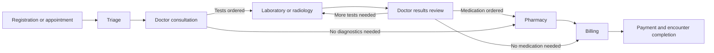

# MediMesh user guide

Version: 1.0.0-rc.1
Audience: clinic and hospital staff
Purpose: safe day-to-day use of the MediMesh clinical operations system

## 1. What MediMesh does

MediMesh keeps one patient encounter connected while different staff members register, triage, consult, test, treat, dispense, admit, and bill the patient. Each workspace shows the work relevant to that role. A patient is not “owned” by one screen or one person: queue entries hand the same encounter to the next responsible team.

The normal outpatient journey is:

The loop between diagnostics and the doctor is intentional. A doctor may review results, order another test, receive the patient again, and only then complete the clinical work. MediMesh creates one active results-review handoff and prevents a diagnostic department from sending the patient directly to billing.

## 2. Sign in and secure your account

1. Open the facility’s HTTPS address supplied by the administrator.
2. Enter your personal username and password. Never share an account.
3. If asked for an authenticator code, open the authenticator app enrolled for your account and enter the current six-digit code.
4. If “MFA enrollment is required” appears, open **Settings → Personal → Multi-factor authentication**. Choose **Set up authenticator**, enter the displayed manual key in Microsoft Authenticator, Google Authenticator, 1Password, or another TOTP app, then enter the generated code.
5. If a temporary password was issued, change it immediately. A password needs at least 12 characters with upper- and lowercase letters, a number, and a symbol.
6. Sign out at the end of a shift or before another person uses the workstation.

An administrator can reset a lost authenticator. This revokes existing sessions and forces enrollment again. Support staff should never ask for your password, authenticator key, current code, M-Pesa PIN, or patient PIN.

## 3. Navigation and patient identity

- The left panel contains the workspaces your role can use. Use the collapse control to create more horizontal room; the choice is remembered on that browser.
- The top search accepts UHID, patient name, or phone number. Prefer the UHID when two patients have similar names.
- Confirm at least two identifiers before opening a record or taking a clinical/payment action: normally full name plus UHID or date of birth.
- The same patient can have several encounters. Work from the active encounter for today’s visit; do not add today’s work to an old completed encounter.
- Status pills and queue labels describe the operational state. Do not infer completion from the presence of a bill or an order alone.

Common queue states:

| State | Meaning | Staff action |
|---|---|---|
| Waiting | Patient is ready for the department | Call the patient in priority order |
| Called | Patient has been called | Confirm identity and begin service |
| In service | A staff member is actively handling the patient | Finish or explicitly defer the work |
| Deferred | Another clinical step must finish first | Do not collect or close prematurely |
| Completed | This queue step is finished | Use the next generated handoff |
| Cancelled / no-show | Work will not continue in this queue | Record the reason according to facility policy |

## 4. Reception and appointments

### Register a new patient

1. Search first. This prevents duplicate UHIDs.
2. Select **New patient** or **Add patient**.
3. Enter the patient’s legal/known name, date of birth or estimated age, sex, phone, address, and next-of-kin information required by facility policy.
4. Confirm the phone number aloud. Billing may use it for an M-Pesa prompt.
5. Save. MediMesh assigns the patient identity; do not invent a second identity if a record already exists.
6. Start today’s visit and place the patient in triage or the configured first queue.

### Manage an appointment

1. Open **Appointments** and use **Book appointment**.
2. Select the existing patient, clinic/doctor, date, time, and visit type.
3. At arrival, mark the appointment checked in and add the patient to the visit flow.
4. A cancelled or missed appointment must use its matching status; do not delete it to make the list look clean.

Before handoff, tell the patient where to wait and confirm that the correct encounter appears in Patient Flow.

## 5. Nurse and triage workflow

1. Open **Patient Flow** and select the triage/waiting patient.
2. Confirm two patient identifiers.
3. Record the current vital signs and chief complaint. Recheck implausible measurements before saving.
4. Set the triage priority based on the facility’s clinical protocol, not queue pressure.
5. Escalate emergencies through the facility’s emergency process; the software does not replace immediate clinical action.
6. Complete triage. MediMesh hands the encounter to consultation.

If observations need repeating later, add a new set for the active encounter. Do not overwrite an earlier clinical measurement merely because it changed.

## 6. Doctor workflow

### First consultation

1. Open the consultation queue and call the patient.
2. Confirm identity, review triage, allergies, medication, history, and previous records.
3. Record history, examination, assessment, diagnosis, treatment plan, and follow-up instructions.
4. Choose only real catalog items when ordering laboratory tests, radiology studies, or medicines. The catalog controls service naming and prices.
5. Complete the consultation.

If there are diagnostic orders, the encounter remains clinically open. Laboratory/radiology workspaces receive their own queue entries and billing is deferred.

### Results review and repeated stages

When the final active diagnostic order is completed, MediMesh creates a consultation queue item labelled **results review** for the ordering doctor/clinic.

1. Reopen the same encounter from the results-review queue.
2. Review the signed laboratory results and/or radiology report in context.
3. Record the interpretation and updated plan.
4. If another test is necessary, order it from this consultation. The patient returns to diagnostics and will return to the doctor again after completion.
5. If medicine is required, prescribe it. The patient moves to pharmacy.
6. If clinical work is complete and nothing remains pending, finish the consultation. The cashier handoff becomes active.

Never create a new patient or unrelated encounter to represent a results review in the same visit. The repeatable loop preserves clinical and billing traceability.

## 7. Laboratory workflow

1. Open **Laboratory** and select a pending order.
2. Confirm the patient and order number; check specimen and preparation requirements.
3. Select **Start** only when the order is being handled.
4. Record collection/processing details and results for every ordered item.
5. Review units, reference ranges, abnormal flags, and critical values. Follow the facility’s critical-result communication policy immediately.
6. Complete the order only after every required result is present and technically validated.

If another lab or radiology order remains open, MediMesh waits. When all diagnostic orders for the encounter are complete, it sends the patient back to the doctor for results review. Laboratory staff must not manually route a completed diagnostic patient to billing.

## 8. Radiology workflow

1. Open **Radiology**, verify the patient, study, body part, and clinical indication.
2. Start/schedule imaging according to the department process.
3. Record completion and create the report. Draft or preliminary content is not a final clinical report.
4. Finalize the report according to the facility’s radiologist authorization policy.
5. Completing the final diagnostic order returns the encounter to the doctor for results review.

Images stored outside MediMesh must retain the same patient, encounter, study, and accession identifiers. Do not upload patient images to personal messaging or storage accounts.

## 9. Pharmacy workflow

1. Open **Pharmacy** and choose a pending prescription.
2. Confirm patient, drug, strength, dose, frequency, duration, allergies, and available stock.
3. Resolve clinical ambiguities with the prescriber; do not silently substitute a different clinical order.
4. Dispense the actual quantity. Stock is reduced through the dispensing/stock transaction, not by editing the catalog count.
5. Record partial dispensing, out-of-stock, cancellation, or completion accurately.
6. When the final clinical service is complete and no doctor review is active, MediMesh enables billing.

Stock corrections use **Settings → Operations → Services & stock → Stock** and require a reason. A stocktake adjustment is not a dispensing transaction.

## 10. Billing and cashier workflow

### Review and collect

1. Open **Billing** when the encounter reaches the cashier queue or use the patient filter.
2. Confirm patient, UHID, invoice number, line items, amount already paid, and balance due.
3. Resolve unexpected services with the responsible department before collection. Do not change a clinical catalog merely to alter one historic invoice.
4. Choose the real payment method and record only money actually received.

### M-Pesa STK prompt

1. Choose **M-Pesa**.
2. Confirm the phone number with the patient. It can differ from the patient’s registered number if an authorized payer is present.
3. Enter a whole-shilling amount no greater than the remaining invoice balance.
4. Select **Send M-Pesa prompt**. Tell the patient to confirm the business name/amount and enter the PIN privately on their own phone.
5. MediMesh shows a 60-second countdown and polls for the authenticated Safaricom callback. The invoice remains unpaid until that callback is reconciled; seeing a prompt on the phone is not proof of payment.
6. If no confirmation arrives in 60 seconds, ask whether the patient declined, timed out, lacked funds, or did not receive it. The banner changes to **Send prompt again**. Selecting it creates a new attempt to the same provided phone number.
7. Do not resend during the active countdown. The server rejects concurrent prompts and tells the cashier when retry becomes available.
8. If an older prompt confirms after a retry/payment, MediMesh still records the confirmed money. Any amount that can no longer be allocated to that invoice remains visible as unapplied patient credit for reconciliation; it must never be discarded.

Never ask the patient to disclose an M-Pesa PIN. A screenshot or SMS is not a substitute for the reconciled callback/receipt in MediMesh.

### Other tenders and receipts

- For cash, count with the patient and record the received amount.
- For card/bank/insurance, enter the provider reference required by facility policy.
- Print a receipt only from the paid invoice. If a payment is disputed, preserve the ledger and follow the refund/reversal policy rather than deleting it.
- At shift end, reconcile MediMesh totals against cash, terminal, bank, and M-Pesa provider reports.

## 11. Ward and bed management

1. Open **Ward occupancy** and select the configured ward.
2. Confirm that a bed is available and appropriate before admission/transfer.
3. Assign the correct patient, encounter, responsible clinician, admission details, and payment category.
4. A transfer frees the old bed only when the new placement is confirmed.
5. Complete discharge documentation and billing handoff before marking the bed available according to facility policy.

Administrators configure wards, capacity, and active status in Operations settings. Reducing configured capacity does not replace the clinical transfer/discharge process for occupied beds.

## 12. Medical records

- Use **Medical Records** to review the longitudinal record and files permitted by your role.
- Add information to the correct patient and encounter. Corrections should preserve auditability; never conceal an error by placing replacement notes under another patient.
- Upload only necessary clinical files. Confirm the file and patient before saving.
- Use the preview/download controls; do not copy protected health information to unmanaged devices.
- Access is logged. Curiosity is not a clinical reason to open a record.

## 13. Administrator guide

### Facility language and operating model

Open **Settings → Operations** to configure:

- facility name, currency, and deployment mode;
- departments and clinic service points;
- ward capacity;
- users and their roles;
- medication, laboratory, and radiology catalogs;
- prices, active/inactive services, turnaround information, and stock thresholds.

Use **solo** mode for a small clinic where one authorized person performs several functions. Apply the solo role preset to that named user; the same queues and audit trail still apply. Use **team** mode for a hospital and assign only the roles each worker needs. Do not create a shared “all staff” login.

### People and access

1. Create a user with a strong temporary password and the minimum roles needed.
2. Deliver the password through an approved separate channel. The user changes it and enrolls MFA.
3. Edit roles immediately when duties change.
4. Suspend departing users; do not reuse their identity for a replacement.
5. If an authenticator is lost, use the administrator MFA reset endpoint/process after identity verification. This revokes sessions and forces enrollment.
6. Review audit events and inactive accounts on the facility’s access-review schedule.

### Catalog and capacity changes

- Add a new catalog item rather than renaming an unrelated existing item.
- Deactivate obsolete items so history remains understandable.
- Record stock increases/decreases with a quantity and reason.
- Test a new workflow/configuration with training data before using it on a live patient.
- Changes to capacity describe operational availability; they do not themselves admit, transfer, or discharge patients.

## 14. Solo-clinic operation

A solo operator may hold receptionist, nurse, doctor, pharmacy, billing, and administrator permissions if that matches the clinic’s governance. Even when one person performs every action:

1. Register and start the encounter.
2. Complete triage.
3. Complete consultation and create real orders.
4. Switch to the department workspace and complete each ordered service.
5. Return to results review if generated.
6. Complete pharmacy and billing only when their handoffs activate.

Following the same sequence preserves timestamps, stock, billing, and the record for future staff. Permission to use several workspaces does not mean stages should be skipped.

## 15. Shift handover checklist

- No emergency or in-service patient is left without a named handover.
- Deferred queues have a documented reason and owner.
- All collected payments are recorded and reconciled.
- Unapplied M-Pesa credits or disputed payments are escalated.
- Critical/unreviewed results follow the facility escalation process.
- Controlled/high-risk stock variances are reported.
- Printed documents and workstation downloads are secured.
- Sign out before leaving the workstation.

## 16. Troubleshooting

| Problem | What to do |
|---|---|
| Patient appears twice | Stop and tell an administrator/records lead. Do not merge by copying data manually. |
| Wrong patient is open | Do not save. Close, search by UHID, and reopen the correct record. Report any saved wrong-patient action. |
| Patient did not move after a result | Confirm every item in every active lab/radiology order is finalized. Refresh Patient Flow. Escalate with encounter and order numbers. |
| Billing appears deferred | An order or doctor results review is still active. Complete the clinical handoff; do not bypass it. |
| M-Pesa says a prompt is active | Wait for the displayed countdown. Retry becomes available after 60 seconds. |
| M-Pesa SMS received but invoice unpaid | Wait for provider callback, then reconcile through the cashier/supervisor process. Do not mark paid from an SMS alone. |
| Authenticator code rejected | Confirm automatic time is enabled on the device and use the newest code. If access is lost, request verified admin reset. |
| Service is missing | Ask an administrator to add/activate the medication, lab test, or radiology study in Operations settings. |
| System unavailable | Follow downtime procedures, protect paper records, record exact times, and enter/reconcile approved downtime data after recovery. |

For technical support, provide the time, your username, workspace, patient UHID/encounter number, and visible error text. Never send passwords, MFA keys/codes, M-Pesa PINs, or unnecessary patient details.
