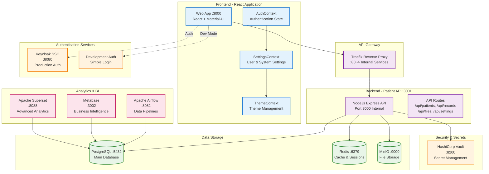

# MediMesh System Architecture Overview

This diagram shows the complete MediMesh application architecture including all 11 services and their relationships.

## Service Breakdown

### Frontend Services
- **Web App (React)** - Single Page Application with Material-UI
- **AuthContext** - Authentication state management
- **SettingsContext** - User and system settings management
- **ThemeContext** - Material-UI theme management

### Backend Services
- **Patient API** - Node.js/Express REST API
- **Traefik** - Reverse proxy and load balancer

### Data Storage
- **PostgreSQL** - Primary relational database
- **Redis** - Caching and session storage
- **MinIO** - S3-compatible object storage

### Security & Authentication
- **Keycloak** - Enterprise SSO (production)
- **Development Auth** - Simple authentication (development)
- **HashiCorp Vault** - Secrets management

### Analytics & Business Intelligence
- **Apache Airflow** - Data pipeline orchestration
- **Metabase** - Business intelligence and reporting
- **Apache Superset** - Advanced data visualization

## Key Features
- **Microservices Architecture** - 11 containerized services
- **Dual Authentication** - Production (Keycloak) and Development modes
- **HIPAA Compliance** - Audit trails and data protection
- **Real-time Settings** - Dynamic configuration across all components
- **Enterprise Analytics** - Complete BI stack for healthcare insights