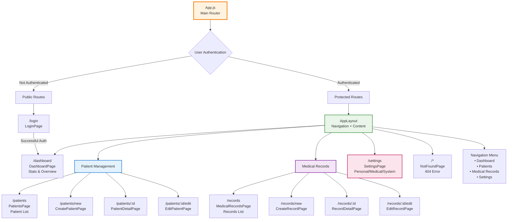

# MediMesh Frontend Routing Structure

This diagram shows the complete React Router configuration and navigation flow.

## Route Configuration

### Public Routes (No Authentication Required)
- `/login` → **LoginPage** - User authentication interface

### Protected Routes (Authentication Required)
All protected routes are wrapped in the `AppLayout` component which provides:
- Navigation sidebar
- Header with user menu
- Main content area

#### Core Application Routes
- `/` → Redirects to `/dashboard`
- `/dashboard` → **DashboardPage** - Statistics and overview

#### Patient Management Routes
- `/patients` → **PatientsPage** - Patient list with search and filters
- `/patients/new` → **CreatePatientPage** - New patient registration form
- `/patients/:id` → **PatientDetailPage** - Patient information display
- `/patients/:id/edit` → **EditPatientPage** - Edit patient information

#### Medical Records Routes
- `/records` → **MedicalRecordsPage** - Medical records list with filters
- `/records/new` → **CreateRecordPage** - New medical record form
- `/records/:id` → **RecordDetailPage** - Medical record details
- `/records/:id/edit` → **EditRecordPage** - Edit medical record

#### System Routes
- `/settings` → **SettingsPage** - Multi-tab settings interface
- `/*` → **NotFoundPage** - 404 error page

## Navigation Structure

### Sidebar Navigation
- **Dashboard** - Statistics and overview
- **Patients** - Patient management
- **Medical Records** - Clinical documentation
- **Settings** - System configuration (role-based access)

### Route Protection
- All routes except `/login` require authentication
- Navigation items are filtered based on user roles
- Automatic redirection to login if not authenticated
- Automatic redirection to dashboard if already authenticated

## Role-Based Access
- **Admin** - Access to all routes including system settings
- **Doctor/Nurse** - Access to clinical routes (patients, records)
- **Viewer** - Read-only access to clinical data

## Key Features
- **Protected Routes** - Authentication-based access control
- **Role-Based Navigation** - Menu items filtered by user role
- **Responsive Layout** - Mobile-friendly navigation
- **Breadcrumb Navigation** - Clear navigation context
- **Deep Linking** - Direct access to specific records/patients