# MediMesh Backend API Routing Structure

This diagram shows the complete Express.js API routing structure and endpoints.

```mermaid
graph TD
    API[Patient API Server<br/>Express.js :3001] --> HEALTH["/health"<br/>Health Routes<br/>No Auth Required]
    
    API --> AUTH_GUARD{Authentication<br/>Middleware}
    
    AUTH_GUARD -->|Token Valid| PATIENTS["/api/patients"<br/>Patient Routes]
    AUTH_GUARD -->|Token Valid| RECORDS["/api/records"<br/>Medical Records]
    AUTH_GUARD -->|Token Valid| FILES["/api/files"<br/>File Management]
    AUTH_GUARD -->|Token Valid| SETTINGS["/api/settings"<br/>Settings Management]
    
    API -->|Dev Mode Only| DEV_ROUTES[Development Routes]
    DEV_ROUTES --> AUTH_DEV["/api/auth"<br/>Simple Authentication]
    DEV_ROUTES --> SEED["/api/seed"<br/>Test Data Seeding]
    
    PATIENTS --> P_LIST["GET /<br/>List all patients"]
    PATIENTS --> P_STATS["GET /statistics<br/>Patient statistics"]
    PATIENTS --> P_GET["GET /:id<br/>Get patient details"]
    PATIENTS --> P_CREATE["POST /<br/>Create new patient"]
    PATIENTS --> P_UPDATE["PUT /:id<br/>Update patient"]
    PATIENTS --> P_DELETE["DELETE /:id<br/>Delete patient"]
    PATIENTS --> P_RECORDS["GET /:id/records<br/>Patient's medical records"]
    
    RECORDS --> R_LIST["GET /<br/>List medical records"]
    RECORDS --> R_STATS["GET /statistics<br/>Record statistics"]
    RECORDS --> R_TYPES["GET /types<br/>Available record types"]
    RECORDS --> R_GET["GET /:id<br/>Get record details"]
    RECORDS --> R_CREATE["POST /<br/>Create new record"]
    RECORDS --> R_UPDATE["PUT /:id<br/>Update record"]
    RECORDS --> R_DELETE["DELETE /:id<br/>Delete record"]
    RECORDS --> R_BULK["POST /bulk<br/>Bulk operations"]
    RECORDS --> R_EXPORT["GET /export<br/>Export records"]
    
    FILES --> F_UPLOAD["POST /upload<br/>Upload files"]
    FILES --> F_GET["GET /:fileId<br/>Get file info"]
    FILES --> F_LIST["GET /<br/>List files"]
    FILES --> F_DELETE["DELETE /:fileId<br/>Delete file"]
    FILES --> F_TYPES["GET /info/allowed-types<br/>Get allowed file types"]
    FILES --> F_CATS["GET /info/categories<br/>Get file categories"]
    
    SETTINGS --> S_USER_GET["GET /user<br/>Get user settings"]
    SETTINGS --> S_USER_PUT["PUT /user<br/>Update user settings"]
    SETTINGS --> S_USER_RESET["POST /user/reset<br/>Reset user settings"]
    SETTINGS --> S_USER_SCHEMA["GET /user/schema<br/>Get settings schema"]
    SETTINGS --> S_SYS_GET["GET /system<br/>Get system settings"]
    SETTINGS --> S_SYS_PUT["PUT /system/:key<br/>Update system setting"]
    SETTINGS --> S_AUDIT["GET /system/audit<br/>Get audit logs"]
    SETTINGS --> S_LOGS["GET /logs/*<br/>Application logs"]
    SETTINGS --> S_EXPORT["POST /logs/export<br/>Export logs"]
    
    HEALTH --> H_STATUS["GET /<br/>Service health"]
    HEALTH --> H_READY["GET /ready<br/>Readiness probe"]
    HEALTH --> H_LIVE["GET /live<br/>Liveness probe"]
    
    style API fill:#fff3e0,stroke:#f57c00,stroke-width:3px
    style AUTH_GUARD fill:#ffebee,stroke:#d32f2f,stroke-width:2px
    style PATIENTS fill:#e3f2fd,stroke:#1976d2,stroke-width:2px
    style RECORDS fill:#f3e5f5,stroke:#7b1fa2,stroke-width:2px
    style FILES fill:#e8f5e8,stroke:#388e3c,stroke-width:2px
    style SETTINGS fill:#fce4ec,stroke:#c2185b,stroke-width:2px
```

## API Endpoint Reference

### Health & Monitoring (No Authentication)
- `GET /health` - Service health check with database and Redis status
- `GET /health/ready` - Kubernetes readiness probe
- `GET /health/live` - Kubernetes liveness probe

### Development Routes (Development Mode Only)
- `POST /api/auth/login` - Simple authentication for testing
- `GET /api/auth/me` - Get current user information
- `POST /api/seed` - Seed database with test data

### Patient Management (`/api/patients`)
All routes require authentication and appropriate role permissions.

- `GET /` - List all patients with pagination and filtering
- `GET /statistics` - Patient demographics and statistics
- `GET /:id` - Get detailed patient information
- `POST /` - Create new patient record
- `PUT /:id` - Update existing patient information
- `DELETE /:id` - Delete patient record (soft delete with audit)
- `GET /:id/records` - Get all medical records for a specific patient

### Medical Records (`/api/records`)
Clinical documentation management endpoints.

- `GET /` - List medical records with filtering and pagination
- `GET /statistics` - Medical records statistics and analytics
- `GET /types` - Get available medical record types
- `GET /:id` - Get detailed medical record information
- `POST /` - Create new medical record
- `PUT /:id` - Update existing medical record
- `DELETE /:id` - Delete medical record (soft delete with audit)
- `POST /bulk` - Bulk operations for multiple records
- `GET /export` - Export medical records in various formats

### File Management (`/api/files`)
Secure file upload and management for medical documents.

- `POST /upload` - Upload files with metadata and category assignment
- `GET /:fileId` - Get file information and metadata
- `GET /` - List files with filtering by patient, record, or category
- `DELETE /:fileId` - Delete file from storage and database
- `GET /info/allowed-types` - Get system-configured allowed file types
- `GET /info/categories` - Get available file categories

### Settings Management (`/api/settings`)
User and system configuration management.

#### User Settings
- `GET /user` - Get current user's settings
- `PUT /user` - Update user settings
- `POST /user/reset` - Reset user settings to defaults
- `GET /user/schema` - Get user settings schema for validation

#### System Settings (Admin Only)
- `GET /system` - Get system-wide settings
- `PUT /system/:key` - Update specific system setting
- `GET /system/audit` - Get settings change audit log

#### Logging & Monitoring (Admin Only)
- `GET /logs/application` - Get application logs
- `GET /logs/audit` - Get audit logs for compliance
- `GET /logs/errors` - Get error logs for debugging
- `POST /logs/export` - Export logs in various formats

## Security & Middleware

### Authentication Middleware
- JWT token validation for all protected routes
- Role-based access control (RBAC)
- Development mode bypass for testing

### Audit Logging
- All CRUD operations are automatically logged
- User actions tracked for HIPAA compliance
- IP address and user agent logging

### Rate Limiting
- Per-user rate limits based on role
- Different limits for different user types
- Protection against abuse and DoS attacks

### Input Validation
- Joi schema validation for all inputs
- Sanitization of user data
- Protection against injection attacks

## Error Handling
- Standardized error response format
- Detailed error logging for debugging
- User-friendly error messages
- HTTP status code compliance

## Data Flow
1. **Request** → Authentication → Validation → Business Logic → Database
2. **Response** → Data Formatting → Audit Logging → Client Response
3. **Files** → Validation → MinIO Storage → Database Metadata → Response