# MediMesh Component Hierarchy & Structure

This diagram shows the React component hierarchy and organization.

```mermaid
graph TB
    APP[App.js<br/>Main Application] --> PROVIDERS[Context Providers]
    
    PROVIDERS --> AUTH_CONTEXT[AuthContext<br/>Authentication State]
    PROVIDERS --> SETTINGS_CONTEXT[SettingsContext<br/>User & System Settings]
    PROVIDERS --> THEME_CONTEXT[ThemeContext<br/>Theme Management]
    
    APP --> ROUTES[React Router]
    
    ROUTES --> PUBLIC[Public Routes]
    PUBLIC --> LOGIN_PAGE[LoginPage<br/>Authentication Form]
    
    ROUTES --> PROTECTED[Protected Routes]
    PROTECTED --> APP_LAYOUT[AppLayout<br/>Main Layout Container]
    
    APP_LAYOUT --> HEADER[Header Component<br/>• App Title<br/>• User Menu<br/>• Navigation]
    APP_LAYOUT --> SIDEBAR[Sidebar Navigation<br/>• Dashboard<br/>• Patients<br/>• Records<br/>• Settings]
    APP_LAYOUT --> MAIN_CONTENT[Main Content Area]
    
    MAIN_CONTENT --> DASHBOARD[DashboardPage<br/>Statistics & Overview]
    MAIN_CONTENT --> PATIENT_PAGES[Patient Pages]
    MAIN_CONTENT --> RECORD_PAGES[Medical Record Pages]
    MAIN_CONTENT --> SETTINGS_PAGE[SettingsPage<br/>Multi-tab Interface]
    
    PATIENT_PAGES --> PATIENTS_LIST[PatientsPage<br/>Patient List & Search]
    PATIENT_PAGES --> PATIENT_DETAIL[PatientDetailPage<br/>Patient Information]
    PATIENT_PAGES --> CREATE_PATIENT[CreatePatientPage<br/>New Patient Form]
    PATIENT_PAGES --> EDIT_PATIENT[EditPatientPage<br/>Edit Patient Form]
    
    RECORD_PAGES --> RECORDS_LIST[MedicalRecordsPage<br/>Records List & Filters]
    RECORD_PAGES --> RECORD_DETAIL[RecordDetailPage<br/>Record Information]
    RECORD_PAGES --> CREATE_RECORD[CreateRecordPage<br/>New Record Form]
    RECORD_PAGES --> EDIT_RECORD[EditRecordPage<br/>Edit Record Form]
    
    SETTINGS_PAGE --> PERSONAL_TAB[Personal Settings<br/>Profile & Preferences]
    SETTINGS_PAGE --> MEDICAL_TAB[Medical Settings<br/>Clinical Defaults]
    SETTINGS_PAGE --> SYSTEM_TAB[System Settings<br/>Admin Configuration]
    
    APP_LAYOUT --> COMMON_COMPONENTS[Common Components]
    COMMON_COMPONENTS --> LOADING[LoadingSpinner<br/>Loading States]
    COMMON_COMPONENTS --> FILE_UPLOAD[FileUpload<br/>File Upload Interface]
    COMMON_COMPONENTS --> FILE_PREVIEW[FilePreview<br/>File Display & Management]
    
    CREATE_PATIENT --> FILE_UPLOAD
    EDIT_PATIENT --> FILE_UPLOAD
    EDIT_PATIENT --> FILE_PREVIEW
    CREATE_RECORD --> FILE_UPLOAD
    EDIT_RECORD --> FILE_UPLOAD
    EDIT_RECORD --> FILE_PREVIEW
    
    AUTH_CONTEXT -.->|Provides Auth State| ALL_COMPONENTS[All Protected Components]
    SETTINGS_CONTEXT -.->|Provides Settings| ALL_COMPONENTS
    THEME_CONTEXT -.->|Provides Theme| ALL_COMPONENTS
    
    style APP fill:#fff3e0,stroke:#f57c00,stroke-width:3px
    style PROVIDERS fill:#ffebee,stroke:#d32f2f,stroke-width:2px
    style APP_LAYOUT fill:#e8f5e8,stroke:#388e3c,stroke-width:2px
    style PATIENT_PAGES fill:#e3f2fd,stroke:#1976d2,stroke-width:2px
    style RECORD_PAGES fill:#f3e5f5,stroke:#7b1fa2,stroke-width:2px
    style SETTINGS_PAGE fill:#fce4ec,stroke:#c2185b,stroke-width:2px
    style COMMON_COMPONENTS fill:#f9fbe7,stroke:#689f38,stroke-width:2px
```



## Component Structure

### Root Application (`App.js`)
The main application component that sets up routing and context providers.

### Context Providers
Global state management using React Context API:

#### AuthContext
- User authentication state
- Login/logout functionality
- Role-based permissions
- Token management
- Development vs Production authentication modes

#### SettingsContext
- User settings management
- System settings (admin only)
- Real-time settings updates
- Settings validation and persistence
- Default value management

#### ThemeContext
- Material-UI theme management
- Light/Dark mode switching
- Automatic theme detection
- Theme persistence
- Real-time theme updates

### Layout Components

#### AppLayout
Main application shell containing:
- Header with user menu and navigation
- Sidebar navigation with role-based filtering
- Main content area for page components
- Responsive design for mobile/desktop

#### Header Component
- Application title and branding
- User profile avatar and menu
- Logout functionality
- Mobile navigation toggle

#### Sidebar Navigation
- Dashboard link
- Patient management links
- Medical records links
- Settings link (role-based visibility)
- Active route highlighting

### Page Components

#### Dashboard Pages
- **DashboardPage** - System overview, statistics, and quick actions

#### Patient Management Pages
- **PatientsPage** - Patient list with search, filtering, and pagination
- **PatientDetailPage** - Complete patient information display
- **CreatePatientPage** - New patient registration form
- **EditPatientPage** - Patient information editing form

#### Medical Records Pages
- **MedicalRecordsPage** - Medical records list with advanced filtering
- **RecordDetailPage** - Detailed medical record view
- **CreateRecordPage** - New medical record creation form
- **EditRecordPage** - Medical record editing form

#### Settings Page
Multi-tab interface with:
- **Personal Settings** - User profile and preferences
- **Medical Settings** - Clinical defaults and templates
- **System Settings** - Admin-only system configuration

#### Authentication Page
- **LoginPage** - User authentication interface

### Common Components

#### FileUpload
Reusable file upload component with:
- Drag-and-drop interface
- Settings-aware file validation
- Progress tracking
- Metadata input (description, tags, privacy)
- Multiple file support

#### FilePreview
File display and management component with:
- File listing and organization
- Download functionality
- File deletion
- Metadata viewing and editing

#### LoadingSpinner
Consistent loading state component used throughout the application.

## Component Features

### Settings Integration
All components that use configurable values integrate with SettingsContext:
- File upload limits from system settings
- Form defaults from user medical settings
- Theme preferences applied globally
- Language and timezone settings

### Role-Based Rendering
Components conditionally render based on user roles:
- Navigation items filtered by permissions
- Admin-only features hidden from non-admin users
- Different data access levels

### Responsive Design
All components built with Material-UI for:
- Mobile-first responsive layout
- Consistent design system
- Accessibility compliance
- Touch-friendly interfaces

### State Management
- Local component state for UI interactions
- Context for global application state
- Custom hooks for reusable stateful logic
- Optimized re-rendering with React.memo and useMemo

## File Structure
```
src/
├── components/
│   ├── common/
│   │   ├── FileUpload.js
│   │   ├── FilePreview.js
│   │   └── LoadingSpinner.js
│   └── layout/
│       └── AppLayout.js
├── pages/
│   ├── DashboardPage.js
│   ├── LoginPage.js
│   ├── PatientsPage.js
│   ├── PatientDetailPage.js
│   ├── CreatePatientPage.js
│   ├── EditPatientPage.js
│   ├── MedicalRecordsPage.js
│   ├── RecordDetailPage.js
│   ├── CreateRecordPage.js
│   ├── EditRecordPage.js
│   ├── SettingsPage.js
│   └── NotFoundPage.js
├── contexts/
│   ├── AuthContext.js
│   ├── SettingsContext.js
│   └── ThemeContext.js
└── services/
    └── api.js
```