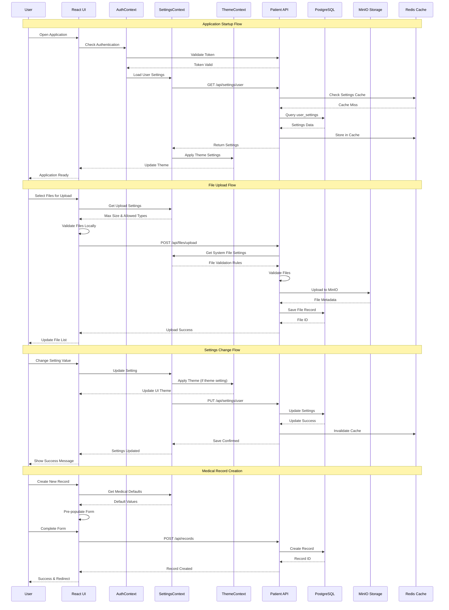

# MediMesh Data Flow & Integration Patterns

This diagram shows the complete data flow through the application and how different components integrate.



## Data Flow Patterns

### 1. Application Initialization Flow
**Sequence:** User → Authentication → Settings → Theme → Ready State

1. **User opens application**
2. **AuthContext checks authentication** status from localStorage/session
3. **Token validation** with backend API
4. **Settings loading** from database via SettingsContext
5. **Cache management** with Redis for performance
6. **Theme application** based on user preferences
7. **UI render** with complete application state

### 2. File Upload Integration Flow
**Sequence:** User Selection → Validation → Upload → Storage → Database

1. **User selects files** for upload
2. **Client-side validation** against settings-defined limits
3. **Settings retrieval** for file size and type restrictions
4. **API upload** with metadata and authentication
5. **Server-side validation** and processing
6. **MinIO storage** for secure file persistence
7. **Database record** creation with file metadata
8. **UI update** with upload results

### 3. Settings Management Flow
**Sequence:** User Change → Context Update → Theme Apply → API Save → Cache Update

1. **User modifies setting** in SettingsPage
2. **SettingsContext update** with new value
3. **Immediate UI update** for responsive feedback
4. **Theme application** if theme-related setting
5. **API persistence** to database
6. **Cache invalidation** for fresh data
7. **Confirmation feedback** to user

### 4. Medical Record Creation Flow
**Sequence:** Form Initialization → Pre-population → User Input → Save → Navigation

1. **User initiates** record creation
2. **Settings retrieval** for medical defaults
3. **Form pre-population** with default values
4. **User input** and form completion
5. **Validation** and API submission
6. **Database persistence** with audit trail
7. **Success feedback** and navigation

## Integration Patterns

### Context Provider Integration
```javascript
// Hierarchical context structure
AuthProvider
├── SettingsProvider
│   ├── ThemeProvider
│   │   └── Application Components
```

**Data Flow:**
- Authentication state flows down from AuthContext
- Settings data flows from SettingsContext to all components
- Theme preferences flow from ThemeContext to Material-UI

### API Integration Pattern
```javascript
// Standardized API call pattern
const apiCall = async () => {
  try {
    setLoading(true);
    const response = await apiService.endpoint();
    setData(response.data);
    updateCache(response.data);
  } catch (error) {
    setError(error.message);
    logError(error);
  } finally {
    setLoading(false);
  }
};
```

### Settings Integration Pattern
```javascript
// Settings-aware component pattern
const Component = () => {
  const { getSetting, getSystemSetting } = useSettings();
  
  const userDefault = getSetting('medical_defaults', 'recordType', 'consultation');
  const systemLimit = getSystemSetting('maxFileSize', 50);
  
  // Use settings in component logic
};
```

## Caching Strategy

### Redis Cache Usage
- **User settings cache** - 30 minute TTL
- **System settings cache** - 60 minute TTL
- **Session data** - Based on session timeout
- **API response cache** - 5 minute TTL for frequently accessed data

### Cache Invalidation
- **Settings changes** - Immediate cache invalidation
- **User logout** - Session cache cleanup
- **System updates** - Selective cache invalidation
- **Scheduled cleanup** - Daily cache maintenance

## Error Handling Flow

### Client-Side Error Handling
1. **Component error boundaries** catch React errors
2. **API error interception** via Axios interceptors
3. **User-friendly error messages** displayed in UI
4. **Error logging** for debugging and monitoring

### Server-Side Error Handling
1. **Input validation** at API endpoints
2. **Database error handling** with transaction rollback
3. **Audit logging** for security and compliance
4. **Structured error responses** for client processing

## Performance Optimizations

### Frontend Optimizations
- **React.memo** for component memoization
- **useMemo and useCallback** for expensive calculations
- **Code splitting** for route-based loading
- **Image optimization** and lazy loading

### Backend Optimizations
- **Database indexing** for fast queries
- **Connection pooling** for database efficiency
- **Query optimization** with proper joins
- **Response compression** for faster transfers

### Caching Optimizations
- **Redis caching** for frequently accessed data
- **Browser caching** for static assets
- **API response caching** for expensive operations
- **CDN integration** for global content delivery

## Security Integration

### Authentication Flow
- **JWT token validation** on every API request
- **Token refresh** before expiration
- **Secure token storage** in httpOnly cookies (production)
- **Role-based access control** throughout application

### Data Protection
- **Input sanitization** at all entry points
- **SQL injection prevention** with parameterized queries
- **XSS protection** with Content Security Policy
- **HTTPS enforcement** for all communications

### Audit Trail
- **User action logging** for all CRUD operations
- **IP address tracking** for security monitoring
- **Change history** for data modifications
- **Compliance reporting** for healthcare regulations