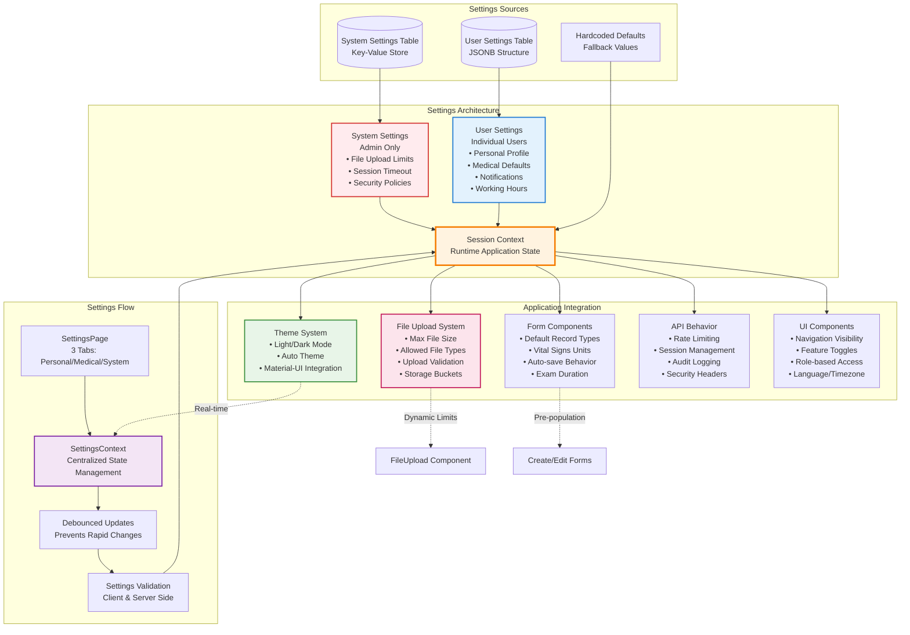

# MediMesh Settings System Integration Flow

This diagram shows how the settings system integrates throughout the entire application.



## Settings System Architecture

### Settings Hierarchy

#### System Settings (Admin Only)
Global configuration affecting all users:
- **File Management**
  - Maximum file upload size (MB)
  - Allowed file types and extensions
  - File storage buckets and categories
- **Security & Sessions**
  - Session timeout duration
  - Password policy requirements
  - Two-factor authentication settings
- **System Behavior**
  - Audit logging configuration
  - Backup settings and frequency
  - Maintenance mode toggles

#### User Settings (Individual)
Personal configuration for each user:
- **Profile Information**
  - Display name and contact details
  - Department and specialization
  - Professional credentials
- **Preferences**
  - Language and timezone
  - Theme selection (light/dark/auto)
  - Date and time formats
- **Medical Defaults**
  - Default record types for new entries
  - Vital signs measurement units
  - Auto-save preferences
  - Template and workflow settings
- **Notifications**
  - Email, SMS, and push preferences
  - Alert types and frequencies
- **Working Hours**
  - Schedule and availability
  - Timezone settings

### Data Storage Structure

#### System Settings Table
```sql
CREATE TABLE system_settings (
    key VARCHAR(255) PRIMARY KEY,
    value JSONB NOT NULL,
    description TEXT,
    category VARCHAR(100),
    updated_at TIMESTAMP DEFAULT CURRENT_TIMESTAMP,
    updated_by VARCHAR(255)
);
```

#### User Settings Table
```sql
CREATE TABLE user_settings (
    id UUID PRIMARY KEY DEFAULT gen_random_uuid(),
    user_id VARCHAR(255) UNIQUE NOT NULL,
    profile JSONB,
    preferences JSONB,
    notifications JSONB,
    medical_defaults JSONB,
    working_hours JSONB,
    created_at TIMESTAMP DEFAULT CURRENT_TIMESTAMP,
    updated_at TIMESTAMP DEFAULT CURRENT_TIMESTAMP
);
```

## Settings Integration Points

### 1. Theme System Integration
**Real-time theme switching based on user preferences**

```javascript
// ThemeContext integration
const ThemeProvider = ({ children }) => {
  const { getSetting } = useSettings();
  
  useEffect(() => {
    const theme = getSetting('preferences', 'theme', 'light');
    applyTheme(theme);
  }, [getSetting]);
};
```

**Features:**
- Immediate theme application on change
- System theme detection for 'auto' mode
- Material-UI theme synchronization
- Persistent theme preferences

### 2. Form Component Integration
**Dynamic form behavior based on medical defaults**

```javascript
// CreateRecordPage integration
const CreateRecordPage = () => {
  const { getSetting } = useSettings();
  
  const defaultValues = {
    recordType: getSetting('medical_defaults', 'defaultRecordType', 'consultation'),
    vitalSignsUnits: getSetting('medical_defaults', 'vitalSignsUnits', 'metric'),
    autoSave: getSetting('medical_defaults', 'autoSaveDrafts', true)
  };
};
```

**Features:**
- Form pre-population with user defaults
- Unit system selection (metric/imperial)
- Auto-save functionality control
- Template and workflow preferences

### 3. File Upload System Integration
**Dynamic file validation based on system settings**

```javascript
// FileUpload component integration
const FileUpload = () => {
  const { getSystemSetting } = useSettings();
  
  const maxFileSize = getSystemSetting('maxFileSize', 50) * 1024 * 1024;
  const allowedTypes = getSystemSetting('allowedFileTypes', defaultTypes);
  
  const validateFile = (file) => {
    return file.size <= maxFileSize && allowedTypes.includes(file.type);
  };
};
```

**Features:**
- Dynamic file size limits
- Configurable allowed file types
- Client-side and server-side validation
- Admin-controlled file restrictions

### 4. API Behavior Integration
**Settings-driven API functionality**

```javascript
// Rate limiting based on settings
const rateLimiter = rateLimit({
  windowMs: getSystemSetting('rateLimitWindow', 15) * 60 * 1000,
  max: getSystemSetting('rateLimitMax', 100)
});
```

**Features:**
- Configurable rate limiting
- Session timeout management
- Audit logging preferences
- Security header configuration

### 5. UI Component Integration
**Role-based and preference-driven UI**

```javascript
// Navigation integration
const Navigation = () => {
  const { hasRole } = useAuth();
  const { getSetting } = useSettings();
  
  const language = getSetting('preferences', 'language', 'en');
  const timezone = getSetting('preferences', 'timezone', 'UTC');
};
```

**Features:**
- Language and localization
- Timezone-aware displays
- Role-based feature visibility
- Preference-driven layouts

## Settings Management Flow

### 1. Settings Page Interface
Multi-tab interface for comprehensive settings management:

#### Personal Settings Tab
- Profile information editing
- Preference configuration
- Notification settings
- Working hours setup

#### Medical Settings Tab
- Clinical default values
- Template preferences
- Workflow configurations
- Unit system selection

#### System Settings Tab (Admin Only)
- Global system configuration
- File upload restrictions
- Security policy settings
- Backup and maintenance

### 2. Settings Context Management
Centralized state management for all settings:

```javascript
const SettingsContext = {
  state: {
    userSettings: {},
    systemSettings: {},
    loading: false,
    error: null
  },
  methods: {
    getSetting: (section, key, defaultValue) => {},
    getSystemSetting: (key, defaultValue) => {},
    updateUserSettings: (updates) => {},
    updateSystemSetting: (key, value) => {}
  }
};
```

### 3. Debounced Updates
Performance optimization to prevent rapid API calls:

```javascript
// Debounced settings updates
const handleSettingChange = useCallback(
  debounce((section, field, value) => {
    updateSetting(section, field, value);
  }, 300),
  []
);
```

### 4. Validation System
Multi-layer validation for data integrity:

- **Client-side validation** - Immediate feedback
- **Server-side validation** - Data integrity
- **Schema validation** - Structure compliance
- **Business rule validation** - Domain-specific rules

## Performance Optimizations

### Caching Strategy
- **Settings cached in Redis** with appropriate TTL
- **Client-side caching** in React Context
- **Selective cache invalidation** on updates
- **Background refresh** for long-running sessions

### Update Optimizations
- **Debounced API calls** to prevent flooding
- **Batched updates** for multiple changes
- **Optimistic updates** for immediate UI feedback
- **Error recovery** with rollback capability

### Memory Management
- **Memoized settings objects** to prevent re-creation
- **Selective re-rendering** with React.memo
- **Garbage collection** of unused settings
- **Memory leak prevention** in long-running sessions

## Security Considerations

### Access Control
- **Role-based settings access** (admin vs user)
- **Field-level permissions** for sensitive settings
- **Audit trail** for all settings changes
- **Change approval** for critical system settings

### Data Protection
- **Encrypted storage** for sensitive settings
- **Secure transmission** over HTTPS
- **Input sanitization** to prevent injection
- **Validation** to prevent malicious data

### Compliance Features
- **HIPAA audit logging** for all changes
- **User consent tracking** for data usage
- **Data retention policies** based on settings
- **Export capabilities** for compliance reporting

## Future Enhancements

### Planned Features
- **Settings inheritance** from organizational levels
- **Backup and restore** for settings configurations
- **Settings templates** for common configurations
- **A/B testing** capabilities for UI preferences
- **Advanced analytics** on settings usage patterns